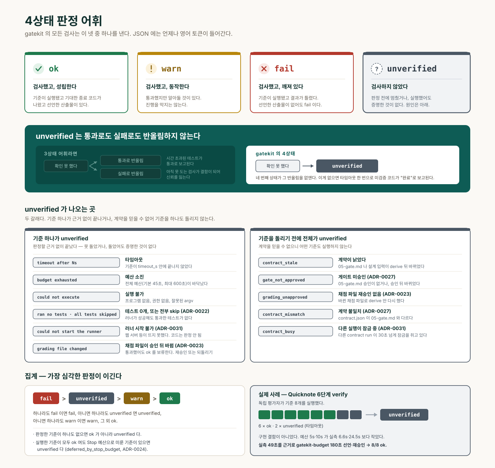

# 핵심 개념



## 4상태 판정 어휘

gatekit의 모든 검사는 `ok` / `warn` / `fail` / `unverified` 중 하나를 낸다. JSON에는 언제나 이 영어 토큰이 들어가고, 화면에 보이는 라벨만 언어에 따라 바뀐다.

| 값 | 뜻 |
|---|---|
| `ok` | 검사했고, 성립한다 |
| `warn` | 검사했고, 동작하지만 알아둘 것이 있다 |
| `fail` | 검사했고, 깨져 있다 |
| `unverified` | **검사하지 않았다** |

집계 규칙은 하나라도 `fail`이면 `fail`, 아니면 하나라도 `unverified`면 `unverified`, 아니면 하나라도 `warn`이면 `warn`, 그 외 `ok`다.

### 왜 3개가 아니라 4개인가

세 개짜리 어휘에서는 "확인하지 못했다"를 통과나 실패 중 하나로 반올림해야 한다. 통과로 반올림하면 시간 초과된 테스트가 통과로 보고된다. 실패로 반올림하면 아직 실행할 수 없는 검사가 결함으로 보고되어 신뢰를 잃는다. 네 번째 상태가 그 반올림을 없앤다.

**이게 없으면**: 타임아웃 한 번으로 미검증 코드가 "완료"로 보고된다.

## 스펙 세트

`spec/` 아래에 사람이 리뷰하고 커밋하는 문서들이다.

| 파일 | 내용 | 필수 |
|---|---|---|
| `00-discovery.md` | 자유 대화로 발굴한 개선과제와 그 verdict(`build`/`reuse`/`eliminate`/`unknown`) | 아니오 |
| `01-prd.md` | 문제, 측정된 현재 상태, 목표, 기능, 수용 기준, 가정 원장 | 예 |
| `02-screens.md` | 화면 목록·흐름·상태·컴포넌트·토큰·근거 없는 영역, 프로토타입 확정 기록 | 아니오 |
| `02-design.md` | 화면을 가로지르는 디자인 패턴·컴포넌트 시각 사양·토큰 요약 | 아니오 |
| `03-architecture.md` | 스택, 데이터 모델, 식별자, 외부 연동, 제약 | 아니오 |
| `04-tasks.md` | `gatekit-task` 펜스로 표현한 작업 목록 | 아니오 |
| `05-gate.md` | `gatekit-criterion` 펜스로 표현한 완료 기준 | 예 |
| `RECOVERY.md` | 진단 루프, 재시도 한도, 범위 잠금, 롤백 절차 | 아니오 |
| `PROGRESS.md` | 현재 상태, 마일스톤, 실패한 시도, 마지막 검증 | 아니오 |
| `tokens.json` | 색상·간격·폰트 등 기계 판독 디자인 값. `mockup`과 `design`이 공유하며 병합 | 아니오 |

각 Markdown 파일의 H2 제목은 `heading-map.json`이 정하며 언어별로 다르다. 한 파일 안에 두 언어의 제목이 섞이면 `spec validate`가 실패로 잡는다.

**이게 없으면**: 검증기가 무엇을 찾아야 할지 몰라 어떤 문서든 통과시킨다.

## verdict 게이트

`00-discovery.md`의 각 개선과제는 모델이 제안하는 `verdict_suggested`와 사용자가 확정하는 `verdict`를 따로 갖는다(`build`/`reuse`/`eliminate`/`unknown`). 사용자가 확정한 값이 `eliminate`나 `reuse`면 `spec validate`가 `pain_verdict_blocks`를 내고 `/gatekit:interview` 진행을 막는다 — 만들지 말아야 할 것, 또는 이미 있는 것을 다시 만드는 것을 인터뷰 전에 걸러낸다. `unknown`은 절대 막지 않는다: 판단을 아직 못 내렸다는 사실 자체를 차단 사유로 삼으면, 판단을 미루는 쪽이 유리해지는 역설이 생긴다.

**이게 없으면**: 이미 실패했거나 대체재가 있는 아이디어에 인터뷰·설계·빌드 전체를 쏟아붓는다.

## 프로토타입 확정 게이트

UI가 있는 프로젝트는 `/gatekit:mockup`이 실제로 클릭 가능한 HTML 프로토타입(`spec/design/prototype-<name>.html`)을 만들고, 사용자가 직접 열어보고 고칠 부분을 말하는 왕복을 거친다. 사용자가 명시적으로 확정하기 전까지는 `02-screens.md`에 `프로토타입 확정 <날짜>` 줄이 생기지 않고, 이 줄이 없으면 `spec validate`가 `prototype_required`를 내며 `/gatekit:tasks`가 진행을 거부한다.

**이게 없으면**: 빌드가 다 끝난 뒤에야 처음으로 실제 화면을 보게 되고, 그때는 되돌리기에 이미 늦다.

## 가정 원장

`spec/01-prd.md`의 `## 가정 원장` 절이다. 사용자에게 확인받지 않고 내린 판단은 전부 여기에 번호가 붙은 행으로 들어가고, 그 판단을 실제로 쓴 자리에는 같은 번호의 인라인 표시가 붙는다.

```markdown
> ⚠️ Assumption 2: {{무엇을 가정했는가}}
```

번호는 인라인 표시와 원장 행 사이에서 1:1로 맞아야 한다. `spec validate`가 이 대응을 검사한다. 인라인 표시에 대응하는 행이 없으면 `fail`, 행에 대응하는 표시가 없으면 `warn`이다. 측정하지 못한 값은 지어내지 않고 "측정 안 됨"으로 쓰고 원장에 올린다.

**이게 없으면**: AI가 대신 내린 결정이 사실처럼 문서에 섞여 나중에 아무도 그게 추측이었다는 것을 모른다.

## 완료 계약

`spec/05-gate.md`의 `gatekit-criterion` 펜스들을 `.gatekit/contract.json`으로 파생시킨 것이다. 각 기준은 셸 없이 실행되는 argv 리스트, 기대 종료 코드, 개별 타임아웃, 산출물 목록으로 이루어진다.

`contract run`이 프로젝트 루트를 작업 디렉터리로 각 기준을 실행한다. 전체 예산은 기본 45초이며 `gatekit-budget` 펜스로 최대 600초까지 올릴 수 있다. 타임아웃이나 예산 소진은 `unverified`이고 절대 `ok`가 아니다. 선언한 산출물이 없으면 `fail`이다.

**이게 없으면**: "완료"가 모델의 자기 보고로만 존재한다.

## 해시 앵커 승인

`.gatekit/approvals.json`에 대상 경로와 그 시점의 SHA-256이 기록된다.

| `approve check` 결과 | 의미 |
|---|---|
| `ok` | 현재 파일 해시가 승인된 해시와 일치 |
| `fail` | 파일이 승인 후 바뀜 — 승인 만료 |
| `unverified` | 승인 기록 자체가 없음 |

해시를 맞추려고 파일을 되돌려 쓰는 것은 금지다. 승인은 사람이 다시 해야 한다.

**이게 없으면**: 실패하는 기준을 지워서 게이트를 통과시킬 수 있다.

## 워커 실행 모드 (`build.execution`)

`.gatekit/config.json`의 `build.execution`이 태스크를 누가 구현하는지 정한다(ADR-0013). **기본값은 `host`** — 빌드를 실행하는 이 세션이 태스크를 순서대로 직접 구현하고, 매 태스크 뒤 그 태스크의 게이트를 돌려 `status.json`을 남긴다. 판정은 그때도 게이트가 내지, 구현한 쪽의 자기 보고가 아니다.

**왜 워커가 기본이 아닌가**: 워커는 같은 모델의 새 세션이라, 이 세션이 이미 아는 프로젝트 맥락을 태스크마다 처음부터 다시 알아내야 한다. 실측 사례(`gk-trial2`)에서 실제 작업 26분이 **4.5시간**이 됐고, 그 차이의 대부분이 35번의 워커 스폰이 각자 프로젝트를 새로 파악한 비용이었다.

그래서 워커는 **모델이 실제로 달라야 할 때**(적대적 검증, Codex 호스트가 Claude에 위임) 또는 **한 라운드에 독립 태스크가 충분히 많아 병렬성이 값을 할 때**만 띄운다 — 둘 다 라운드마다 판단하지, 이 기본값이 정하지 않는다. 예전처럼 항상 워커를 쓰려면 `"execution": "worker"`를 명시한다.

긴 빌드로 세션이 압축(compact)돼도 문제없다 — 태스크 상태와 게이트 결과가 전부 파일에 있고, PreCompact 훅이 압축 직전 `spec/PROGRESS.md`에 진행 상황을 찍어두므로 돌아온 세션이 그 파일을 읽고 이어간다.

**이게 없으면**: 컨텍스트를 이미 가진 세션을 놔두고 매 태스크마다 아무것도 모르는 새 프로세스를 띄워 처음부터 다시 알아내게 한다.

## 세션 원장

`.gatekit/runs/<session_id>.json`이다. 출력 언어, 활성 파이프라인, 질문 예산, 선언된 쓰기 범위, Stop 게이트 차단 횟수와 최종 판정을 담는다. 원자적으로 쓰이며 `session_id`로만 조회된다. "가장 최근 파일" 같은 대체 조회는 없다. `events`는 추가 전용이고 500개를 넘으면 오래된 것부터 버린다.

**이게 없으면**: 게이트들이 서로의 결정을 모른 채 각자 판단한다.

## write_scope

작업이 쓸 수 있는 파일 글로브 목록, 또는 문자열 `"read-only"`다. 두 곳에서 쓰인다.

- `spec/04-tasks.md`의 작업마다 선언되고, 워커 세션 안에서 쓰기 게이트가 `GATEKIT_TASK_ID` 환경변수를 근거로 강제한다.
- 서브에이전트를 띄울 때 `gatekit-scope` 펜스로 선언되고, spawn 게이트가 이미 활성인 범위와 겹치는지 검사한다.

같은 라운드의 두 작업이 겹치는 범위를 가지면 `spec validate`가 `fail`을 낸다. 충돌을 없애려고 범위를 넓히면 안 된다. 라운드를 나누거나 작업을 다시 자른다.

**이게 없으면**: 병렬 워커가 서로의 파일을 조용히 덮어쓴다.

## output_lang 자동 감지

`lang.detect(text)`가 텍스트의 한글 음절·자모와 라틴 문자 수를 세어, 한글이 전체 글자의 30% 이상이면 `ko`, 아니면 `en`을 낸다. 빈 텍스트는 `en`이다.

프롬프트 게이트가 매 프롬프트에서 이 값을 세션 원장에 저장하고, 커맨드들이 원장에서 읽어 쓴다. 사용자에게 보이는 모든 문자열(채팅, `AskUserQuestion` 라벨, `spec/` 아래 파일)이 이 언어로 나간다. 식별자는 절대 번역하지 않는다. `ko`와 `en` 템플릿만 존재하며, 다른 언어는 `en` 템플릿으로 대체하고 커맨드가 그 사실을 한 번 알린다. 빈 프롬프트는 언어 신호가 없으므로 저장된 값을 유지한다.

**이게 없으면**: 한국어로 물었는데 스펙 문서가 영어로 나온다.
