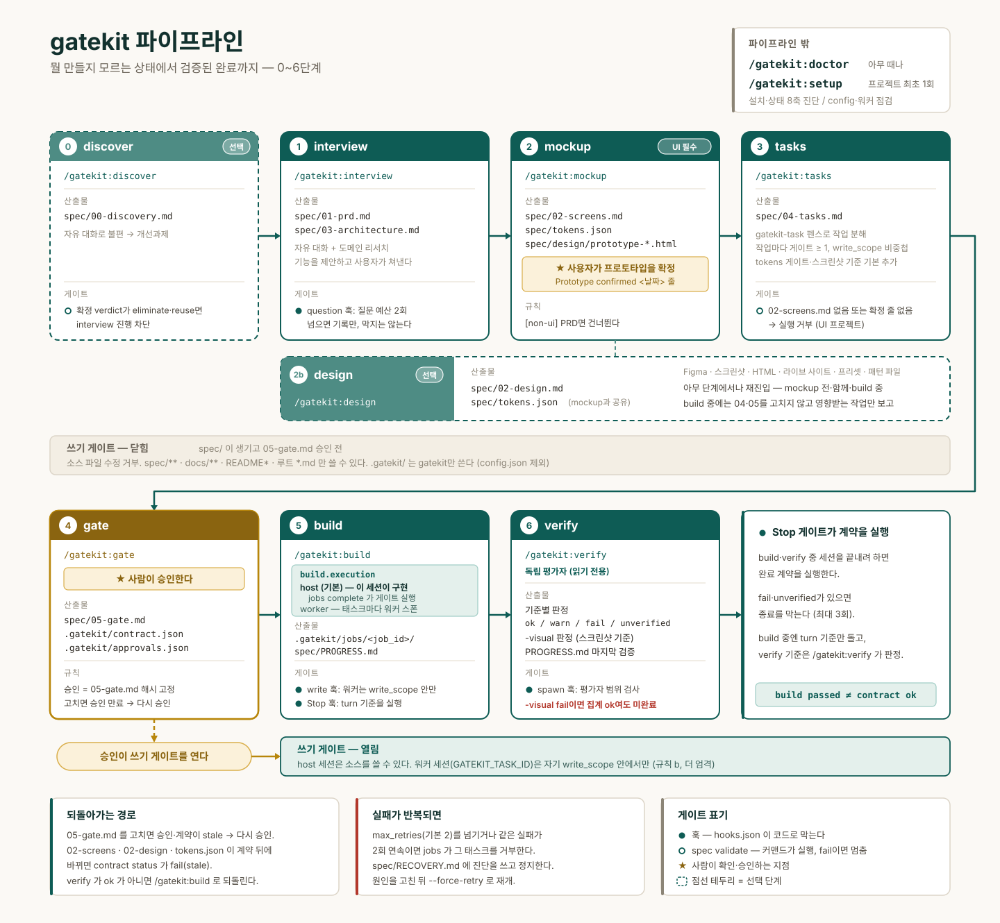

# 파이프라인 전체 흐름



## 전체 다이어그램

```text
                    [ /gatekit:doctor ]  ← 아무 때나. 설치·상태 8축 진단
                    [ /gatekit:setup  ]  ← 프로젝트 최초 1회. config·워커 점검
                              │
   뭘 만들지 모름              ▼
        │            ┌──────────────────┐
        └───────────▶│ 0. discover (선택)│──▶ spec/00-discovery.md
                     │  자유 대화        │    (verdict 게이트)
                     └──────────────────┘
                              │
   문제는 정해짐               ▼
        │            ┌──────────────────┐
        └───────────▶│ 1. interview     │──▶ spec/01-prd.md
                     │  자유 대화 + 리서치│    spec/03-architecture.md
                     └──────────────────┘
                              │
                              ▼
                     ┌──────────────────┐
                     │ 2. mockup        │──▶ spec/02-screens.md
                     │  ★ 프로토타입 확정│    spec/tokens.json
   패턴·레퍼런스 사이트 └──────────────────┘    spec/design/prototype-*.html
        │                     │
        │            ┌──────────────────┐
        └───────────▶│ 2b. design (선택)│──▶ spec/02-design.md
                     │  (아무 단계에서나│    spec/tokens.json (mockup과 공유)
                     │   재진입 가능)   │    01의 가정 원장에 gap 행 추가
                     └──────────────────┘
                              │
                              ▼
                     ┌──────────────────┐
                     │ 3. tasks         │──▶ spec/04-tasks.md
                     └──────────────────┘    (gatekit-task 펜스)
                              │
                              ▼
                     ┌──────────────────┐
                     │ 4. gate          │──▶ spec/05-gate.md
                     │   ★ 사람 승인    │    .gatekit/contract.json
                     └──────────────────┘    .gatekit/approvals.json
                              │
              [쓰기 게이트가 여기서 열린다]
                              │
                              ▼
                     ┌──────────────────┐
                     │ 5. build         │──▶ .gatekit/jobs/<job_id>/
                     │ execution:worker →워커│ spec/PROGRESS.md
                     │ execution:host →이 세션│
                     └──────────────────┘
                              │
                              ▼
                     ┌──────────────────┐
                     │ 6. verify        │──▶ 독립 평가자 판정 (+ -visual)
                     │   producer≠evaluator│  spec/PROGRESS.md 마지막 검증
                     └──────────────────┘
                              │
                   [Stop 게이트가 계약을 실행]
```

## 단계별 입력·출력·게이트

| 단계 | 커맨드 | 입력 | 출력 | 관련 게이트 |
|---|---|---|---|---|
| 0 | `/gatekit:discover` | 아무것도 없어도 된다. 자유 대화 | `00-discovery.md` | `spec validate`가 확정 verdict `eliminate`/`reuse`를 `pain_verdict_blocks`로 차단. 선택 단계 |
| 1 | `/gatekit:interview` | discovery가 고른 개선과제(있으면), 기존 레포 | `01-prd.md`, `03-architecture.md` | 자유 대화 + 도메인 리서치(`WebSearch`)로 기능을 제안, 사용자가 쳐낸다 |
| 2 | `/gatekit:mockup` | Figma URL, HTML, 스크린샷, 또는 디자인 프리셋 | `02-screens.md`, `tokens.json`, 확정된 프로토타입 | 프로토타입을 사용자가 확정해야 `prototype_required`가 풀린다 |
| 2b | `/gatekit:design` | Figma URL, 스크린샷, HTML, 라이브 사이트 URL, 프리셋 이름, 사용자 패턴 파일 | `02-design.md`, `tokens.json`(공유), 원장 gap 행 | question 게이트. `spec/tokens.json`이 있으면 `tasks`가 스타일 관련 작업에 tokens 게이트를 기본 추가 |
| 3 | `/gatekit:tasks` | `01`, `02`, `02-design`, `03`, 실제 레포 구조 | `04-tasks.md` | `02-screens.md`에 프로토타입 확정 기록이 없으면 실행 거부 |
| 4 | `/gatekit:gate` | `01`의 수용 기준, `04`의 작업 | `05-gate.md`, `contract.json`, 승인 | 승인이 쓰기 게이트를 연다 |
| 5 | `/gatekit:build` | `04-tasks.md`, 승인된 `05-gate.md` | 잡 디렉터리, `PROGRESS.md` | write 게이트가 `write_scope` 강제. UI 작업은 스크린샷 산출물 요구. `build.execution`이 `worker`(기본)면 태스크마다 워커를 스폰하고, `host`면 이 세션이 직접 구현한다(ADR-0013) |
| 6 | `/gatekit:verify` | `contract.json`, `05-gate.md` | 판정표(코드 기준 + `-visual`), `PROGRESS.md` 마지막 검증 | spawn 게이트가 평가자 범위 검사, stop 게이트가 계약 실행 |

`doctor`와 `setup`은 이 순서에 속하지 않는다. `setup`은 프로젝트 최초 1회, `doctor`는 문제가 의심될 때 언제든 실행한다.

`/gatekit:design`은 이 표의 다른 단계와 달리 순서에 고정되지 않는다. 목업 이전, 목업과 함께, 또는 `build` 도중에도 실행할 수 있다. `build` 도중 실행되면 `04-tasks.md`나 `05-gate.md`를 직접 고치지 않고, 영향받는 작업 목록만 보고한다 — 재위임은 `/gatekit:tasks`와 `/gatekit:gate`를 다시 거쳐야 한다. `02-screens.md`, `02-design.md`, `tokens.json` 중 하나라도 계약 파생 이후 바뀌면 `contract status`가 `fail`(stale)을 반환한다.

## 각 단계에서 무엇이 막히는가

### 1단계 이전

`spec/` 디렉터리가 아직 없으면 쓰기 게이트는 아무것도 막지 않는다. 규칙 (a)는 `spec/`이 존재할 때만 발동한다.

### 1~3단계 중

`spec/`이 생겼고 `05-gate.md`가 승인되지 않았으므로, 쓰기 게이트가 소스 파일 수정을 거부한다. `spec/**`, `.gatekit/**`, `docs/**`, `README*`, 루트의 `*.md`만 쓸 수 있다. 이 허용 목록이 없으면 게이트를 열어줄 스펙 자체를 쓸 수 없다.

### 4단계 승인 시점

사용자가 `05-gate.md`를 읽고 승인하면 해시가 고정된다. 그 순간부터 쓰기 게이트 규칙 (a)가 통과되어 소스 파일을 쓸 수 있다. 동시에 Stop 게이트가 이 계약을 실행 대상으로 삼는다.

### 5단계 중

워커 세션에는 `GATEKIT_TASK_ID`가 설정되어 있고, 쓰기 게이트 규칙 (b)가 발동한다. 규칙 (b)는 (a)보다 엄격해서 문서 허용 목록이 없다. `src/auth/**`를 배정받은 워커는 PRD를 고칠 수 없다.

### 6단계와 종료

`build`가 전부 `passed`여도 완료 계약 통과와는 다르다. `verify`만 그것을 보고한다. 세션을 끝내려 하면 Stop 게이트가 계약을 실행하고, `fail`이나 `unverified`가 있으면 최대 3회까지 종료를 막는다.

## 되돌아가는 경로

- `05-gate.md`를 고치면 승인이 만료되고 계약이 stale이 된다. `contract derive` 후 다시 승인해야 한다.
- 태스크가 3회 연속 실패하면 `build`는 재위임을 멈추고 `spec/RECOVERY.md`에 진단을 쓴 뒤 파이프라인을 정지한다. 코드를 직접 고치지 않는다.
- `verify`가 `ok`가 아니면 무엇이 바뀌어야 하는지 나열하고 멈춘다. 수정은 `/gatekit:build`로 되돌린다.
