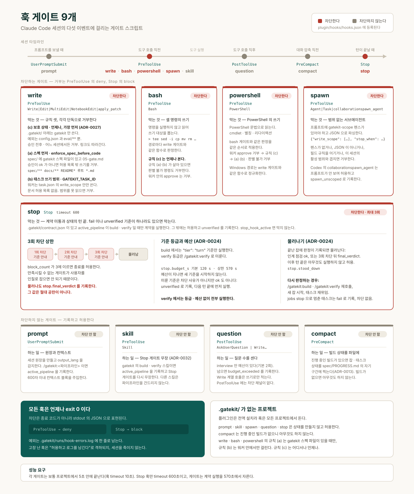

# 훅 게이트

`plugin/hooks/hooks.json`에 스크립트 8개가 등록된다. 이 파일은 Claude Code가 자동으로 읽으며 `plugin.json`에 나열하지 않는다. 중복 참조는 플러그인 로드를 실패시킨다. 이와 별개로, `tokens` 게이트는 훅이 아니라 `spec/04-tasks.md`의 태스크가 선언하는 태스크 게이트다(아래 별도 절 참고).

| 게이트 | 이벤트 | 대상 도구 | 차단하는가 |
|---|---|---|---|
| prompt | `UserPromptSubmit` | 없음 | 아니오 |
| write | `PreToolUse` | `Write`, `Edit`, `MultiEdit`, `NotebookEdit` | 예 |
| bash | `PreToolUse` | `Bash` | 예 |
| powershell | `PreToolUse` | `PowerShell` | 예 |
| spawn | `PreToolUse` | `Agent`, `Task` | 예 |
| question | `PostToolUse` | `AskUserQuestion`, `Write`/`Edit`/`MultiEdit`/`NotebookEdit` | 아니오 (채널이 없다) |
| compact | `PreCompact` | 없음 | 아니오 |
| stop | `Stop` | 없음 | 예 (최대 3회) |



## prompt 게이트

**언제**: 사용자가 프롬프트를 보낼 때마다.

**하는 일**: 세션 원장을 만들거나 불러오고, 프롬프트 텍스트에서 `output_lang`을 감지해 저장한다. 인자 없는 `/gatekit:build`처럼 언어를 알 수 없는 프롬프트만 있었던 세션에서는 `spec/01-prd.md`(없으면 `spec/00-discovery.md`)의 앞쪽 본문 40줄로 언어를 정한다. YAML 프런트매터, 코드 블록, 표 행, 인라인 코드는 영어인 경우가 많아 세지 않고, 제목·문단·목록 줄만 센다. 이후 언어가 드러나는 프롬프트가 오면 그쪽을 따르고, 그 세션에서는 스펙을 다시 보지 않는다(ADR-0026). 프롬프트가 `/gatekit:<파이프라인>` 호출이면(Claude Code는 슬래시 명령을 `<command-name>/gatekit:build</command-name>` 태그 본문으로 넘긴다) 원장의 `active_pipeline`을 그 값으로 기록한다(`doctor`·`setup`은 지운다). stop 게이트와 질문 예산은 이 값을 읽으므로, 파이프라인 기록은 커맨드 산문이 아니라 이 게이트가 코드로 한다. 다른 파이프라인으로 넘어가면 질문 예산은 0부터 다시 센다. 그리고 600자 이내의 컨텍스트 블록을 대화에 주입한다. 블록에는 출력 언어, 활성 파이프라인, 질문 예산 사용량, 게이트 승인 상태, 계약 상태가 들어간다.

**차단**: 하지 않는다.

**주의**: 빈 프롬프트는 언어 신호가 없으므로 저장된 언어를 그대로 둔다. 빈 줄 하나를 보냈다고 영어로 바뀌지 않는다.

## write 게이트

**언제**: `Write`·`Edit`·`MultiEdit`·`NotebookEdit` 호출 직전.

독립적인 세 규칙이 있고 각각이 단독으로 쓰기를 거부할 수 있다. 보호 상태 규칙 (c)가 가장 먼저, 언제나 적용된다.

### 규칙 (c) 보호 상태 — `.gatekit/`은 gatekit만 쓴다 (ADR-0027)

`.gatekit/` 아래는 `config.json`(사용자 설정)과 `eval/**`(평가자 스크래치)을 빼고 전부 gatekit 자신이 쓴다. 승인 기록(`approvals.json`), 계약(`contract.json`), 마지막 판정 기록(`runs/contract-last.json`), 세션 원장(`runs/<session_id>.json`), 잡 디렉터리(`jobs/`), `attempts.json`, `baseline.json`, `runs/hook-errors.log`가 여기 든다. 훅과 CLI(`approve`, `contract derive`, `jobs …`)는 이 파일들을 도구 호출이 아니라 프로세스 안에서 쓰므로 이 규칙에 걸리지 않는다. 그 밖의 쓰기는 `Write`·`Edit`·`MultiEdit`·`NotebookEdit`·`apply_patch` 모두, 승인 전후, 어느 세션에서든, `GATEKIT_TASK_ID`나 `enforce_spec_before_code`와 상관없이 거부한다. 경로는 대소문자를 무시하고, `\`를 `/`로, NTFS 스트림 접미사(`::$DATA`)와 끝의 점·공백을 잘라낸 뒤, 쓴 그대로와 realpath 양쪽으로 비교한다. 심볼릭 링크와(대상이 있으면) 하드 링크도 따라간다. 다른 프로젝트의 `.gatekit/`도 보호된다. 읽기(`Read`, `cat`, `jq`)는 막지 않는다.

이 규칙이 있는 이유는 승인 기록이나 Stop 게이트가 재사용하는 판정 기록을 손으로 쓰면 사용자 없이 게이트가 열리거나 판정 없이 Stop이 통과하기 때문이다.

**차단됐을 때 할 일**: 기준이나 게이트를 바꾸려면 `/gatekit:gate`를 다시 실행한다. 설정은 `config.json`에서 바꾼다. gatekit 상태를 지우려면 먼저 플러그인을 제거하고 터미널에서 직접 지운다(`UNINSTALL.md`). 오래된 잡은 `python3 "${CLAUDE_PLUGIN_ROOT}/bin/gatekit.py" jobs clean`으로 정리한다.

### 규칙 (a) 스펙 먼저

`enforce_spec_before_code`가 켜져 있고 `spec/` 디렉터리가 존재하는데 `spec/05-gate.md` 승인이 `ok`가 아니면, 아래 허용 목록 밖의 쓰기를 거부한다.

```text
spec/**
.gatekit/**
docs/**
README*
*.md   (루트 레벨만)
```

이 허용 목록이 있는 이유는 게이트를 열어줄 스펙 자체를 쓸 수 있어야 하기 때문이다.

**차단됐을 때 할 일**: `/gatekit:gate`를 실행해 완료 기준을 만들고 사용자가 승인한다. 급하면 `spec/`·`docs/`·루트 마크다운에 먼저 쓴다. 차단 메시지에 현재 승인 상태(`fail` 또는 `unverified`)와 막힌 경로가 나온다.

### 규칙 (b) 태스크 쓰기 범위

`GATEKIT_TASK_ID` 환경변수가 설정된 경우 — 즉 잡 러너가 띄운 워커 세션 안에서 — 그 태스크의 `task.json`에 적힌 `write_scope` 안에서만 쓸 수 있다. 규칙 (b)는 (a)보다 엄격해서 문서 허용 목록이 없다. `src/auth/**`를 배정받은 워커가 PRD를 다시 쓸 이유는 없다.

거부되는 네 가지 경우다.

| 상황 | 메시지 키 |
|---|---|
| 프로젝트 루트 밖 경로 | `outside_root` |
| `task.json`을 읽을 수 없어 범위 확인 불가 | `scope_missing` |
| 범위가 `"read-only"` | `scope_read_only` |
| 범위에 없는 경로 | `scope` |

범위를 확인할 수 없으면 거부한다. 범위를 확립할 수 없는 태스크 id를 주장하는 워커에게는 쓰기 권한을 주지 않는다.

**차단됐을 때 할 일**: 워커 안에서라면 그 태스크의 범위를 벗어난 것이다. `04-tasks.md`의 태스크 분해가 잘못되었다는 신호다. 범위를 넓히지 말고 태스크를 다시 자른다.

## bash 게이트

**언제**: `Bash` 도구가 실행되기 직전.

**하는 일**: 명령 문자열을 실행하지 않고 읽어서 그 명령이 쓸 파일을 뽑아낸 뒤, 각 경로를 write 게이트와 **같은 함수**로 판정한다. 리다이렉션(`>`, `>>`, `&>`), `tee`, `sed -i`, `perl -i`, `cp`/`mv`/`ln`/`install`/`rsync`의 목적지, `touch`/`rm`/`mkdir`/`truncate`/`chmod`/`chown`의 대상, `dd of=`, 그리고 `sort -o`·`curl -o`·`wget -O`·`tar -C`/`-f`·`unzip -d`·`zip`처럼 출력 경로가 인자에 그대로 보이는 도구를 인식한다. `cd`는 `;`, `&&`, `|`, 줄바꿈을 넘어 추적하고, `VAR=`·`sudo`·`env`·`nohup` 접두는 벗기며, 히어독 본문과 `/dev/*`는 무시하고, `sh -c "…"`는 재귀로 읽는다.

**규칙이 꺼져 있을 때**: 규칙 (a)·(b)가 거부할 수 없는 상태(`GATEKIT_TASK_ID` 없음, 게이트 승인됨 또는 `spec/` 없음)에서도 명령은 읽지만, 아래 보호 상태 점검만 그 결과로 판정한다. 나머지는 판정하지 않고 통과시킨다. 읽기는 정적이고 가벼워서 평소 세션이 체감할 비용은 없다.

**판별 불가는 거부**: 규칙이 살아 있는데 쓰기 대상을 알 수 없으면 거부한다. 경로 안의 `$VAR`나 백틱, 알 수 없는 디렉터리로 `cd`, `eval`, `xargs`, `patch`, `trap`, `find -exec`, 작업 트리를 바꾸는 `git` 하위 명령(`apply`, `checkout`, `restore`, `reset`, `merge`, `stash`, `init`, `clone` 등), 인라인 인터프리터 코드(`python3 -c`, `node -e`), 스크립트를 표준 입력으로 받는 인터프리터(`python3 <<PY`, `echo … | node`, `python3 < s.py` — 스크립트 파일이나 `-m 모듈`이 인자에 있으면 해당 없음), `awk`, 명령줄 편집기(`ed`, `ex`, `vim`, `nano`), `busybox`, 파일명을 스스로 정하는 다운로드(`curl -O`, 옵션 없는 `wget`), 프로세스 치환, 짝이 안 맞는 따옴표가 여기 해당한다. 거부 메시지는 이유와 대안(Write/Edit 도구, 리터럴 경로)을 말한다. `unverified`를 `ok`로 반올림하지 않는 것과 같은 원칙이다.

**보호 상태 (ADR-0027)**: 모든 명령을 규칙 (c)에 비춰 읽는다. 쓰기 대상이 gatekit 상태이면, `rm`·`mv`로 그것이나 그것을 담은 디렉터리(`rm -rf .gatekit`, `rm -rf .gatekit/runs`)를 지우거나 옮기면, `.gatekit/`으로 `config.json`·`eval` 외의 무언가를 복사·이동·링크하면(`cp x .gatekit/`, `cp -R src/ .gatekit`), `ln`(`cp -l`/`-s` 포함)이 gatekit 상태나 그것을 담은 디렉터리를 가리키면, `git checkout`/`restore`/`reset`/`stash push`의 경로가 그것이거나 `.gatekit` 디렉터리이면(`git checkout -- .gatekit`), `tar -C`·`unzip -d`의 풀 디렉터리나 `find -exec`/`-delete`의 시작점이 그것이면, 앞에서 `.gatekit`을 담은 변수로 만든 경로이면(`d=.gatekit; echo x > $d/approvals.json`), 판별 불가 명령의 본문이 `.gatekit` 경로를 적었거나(`python3 <<PY` 본문 포함) `.gatekit` 안에서 실행되면 거부한다. 글롭·중괄호, 셸 예약어 뒤의 `cd`, `pushd`, 조건부 `cd`도 따진다. 허용되는 것: `cat`/`jq`/`grep`/`diff`/`ls`/`python3 -m json.tool` 같은 읽기, `git diff`/`log`/`show`/`add`/`commit`/`status`, `.gatekit`을 밖으로 백업하는 `tar -czf`·`zip -r`·`rsync -a .gatekit/ …`·`cp -a .gatekit …`, `mkdir .gatekit`, `.gatekit/eval/` 아래 쓰기, `config.json` 수정, 런처 명령(`approve`, `contract derive`, `contract run`, `jobs …`). `git checkout -- .`, `git reset --hard`, `git stash pop`, `git clean -fdx`는 커밋된 상태를 되살리거나 지우는 명령이라 신뢰 경계로 남긴다. 판별 불가 명령이 경로를 적지 않고 쓰는 경우(문자열을 이어 붙인 경로, 스크립트 파일, 루트에 푸는 압축 파일)는 정적 읽기로 보이지 않는다. 그 효과는 Stop 게이트의 무결성 점검이 막는다(아래).

**한계**: 이름으로 호출되는 프로그램(`npm run build`, `python3 script.py`)이 무엇을 쓰는지는 보지 않는다. 셸 문법을 읽는 게이트이지 모든 바이너리의 동작을 아는 게이트가 아니다. 근거는 `docs/decisions/ADR-0004-bash-write-gate.md`.

**예외 하나 — 워커는 승인하지 않는다**: 훅 환경에 `GATEKIT_TASK_ID`가 있으면(워커 세션) gatekit 자신의 `approve` 하위 명령을 실행하는 명령은 다른 규칙보다 먼저 거부한다. `env -u GATEKIT_TASK_ID python3 …/gatekit.py approve spec/05-gate.md`처럼 환경변수를 지워 `approve`의 거부를 피하는 길을 막기 위해서다. `gatekit.py`·`gatekit`·`-m gatekit` 뒤의 `approve`를 단순 명령마다, `env`/`VAR=` 접두 뒤에서도, `sh -c`·`eval` 문자열 안에서도, 따옴표 경로나 `${CLAUDE_PLUGIN_ROOT}`가 있어도 찾고, 렉싱이 안 되면 패턴으로 찾는다. `approve check`와 `approve list`는 허용한다. 근거는 ADR-0023.

## powershell 게이트

**언제**: Claude Code의 `PowerShell` 도구가 실행되기 직전. Windows에서는 이 도구가 켜져 있으면 PowerShell이 기본 셸이고(Git Bash가 없으면 `Bash` 도구 자체가 등록되지 않는다), 이 도구의 호출은 `Bash` 매처에 걸리지 않는다. 도구 이름은 `PowerShell`, 명령 문자열은 `tool_input.command`다(공식 훅 문서 기준).

**하는 일**: bash 게이트와 **같은 판정**을 같은 순서로 적용한다 — 워커의 `approve` 거부, 보호 상태(규칙 (c), 승인 전후 언제나), 규칙이 살아 있을 때만 규칙 (a)·(b)와 판별 불가 거부. 다른 것은 명령을 읽는 방식뿐이다. PowerShell 문법을 실행하지 않고 읽는다: 줄바꿈·`;`·`&&`·`||`·`|`로 문장을 나누고, `'…'`(`''`), `"…"`(백틱 이스케이프, `""`), 히어스트링 `@'…'@`·`@"…"@`, 백틱 줄 이음, `#`·`<# #>` 주석, 타이포그래피 따옴표·대시를 PowerShell처럼 읽는다. 리다이렉션 `>`, `>>`, `2>`, `*>`, `*>>`는 쓰기다(`2>&1`, `$null`은 아님). cmdlet·매개변수 이름은 대소문자를 가리지 않고, 모듈 접두(`Microsoft.PowerShell.Management\Remove-Item`)와 기본 별칭(`sc`, `ac`, `ni`, `md`, `cp`/`copy`/`cpi`, `mv`/`move`/`mi`, `rm`/`del`/`ri`/`rd`, `ren`, `tee`, `iex`, `cd`/`sl`, `pushd`/`popd` 등)을 풀고, 매개변수 접두 축약(`-Pa`는 `-Path`)과 `-Path:값`, 위치 인자, 쉼표 배열을 cmdlet마다 묶는다. 인식하는 쓰기: `Set-Content`·`Add-Content`·`Clear-Content`·`Out-File`·`Tee-Object -FilePath`, `New-Item`(`-Name`, 심볼릭 링크·하드 링크·정션의 대상 포함), `Copy-Item`·`Move-Item`·`Remove-Item`·`Rename-Item`, `Set-Item`·`*-ItemProperty`·`Set-Acl`, `Export-*`, `Start-Transcript`, `Compress-Archive`·`Expand-Archive`, `Invoke-WebRequest -OutFile`, `Start-Process -RedirectStandardOutput`, 리터럴 인자의 `[IO.File]::WriteAllText`·`AppendAllText`·`WriteAllBytes`·`Copy`·`Move`·`Delete` 등. `Set-Location`·`Push-Location`·`Pop-Location`으로 현재 위치를 추적하고, Windows 경로(백슬래시, 드라이브 문자, `\\?\` 접두, `FileSystem::`, `::$DATA`, 끝의 점·공백, 대소문자)는 write 게이트와 같은 함수로 정규화한다. `Env:`·`Variable:`·`HKLM:` 같은 파일이 아닌 경로는 쓰기가 아니다. 스크립트 블록 `{…}`과 `(…)`·`$(…)`(큰따옴표 안 포함)은 실행될 수 있으므로 코드로 읽고, 리터럴 문자열의 `iex`와 `pwsh -Command "…"`는 재귀로 읽으며, `-EncodedCommand`는 디코딩해 읽는다(판별 불가로도 표시). 네이티브 프로그램은 bash 게이트의 단순 명령 분석에 그대로 넘기므로 `git`, `tar`, `python -c`, `node -e`, 파이프로 코드를 받는 인터프리터, `bash -c '…'`는 bash에서와 같이 판정된다.

**판별 불가는 거부**: 규칙이 살아 있을 때 경로 안의 변수·부분식·스플랫(`@params`), 파이프라인에서 오는 경로(`Get-ChildItem | Remove-Item`), 쓰기 cmdlet의 모르는 매개변수, 알 수 없는 현재 위치, `& $cmd`, `cmd /c`, `wsl`, 셸·인터프리터를 띄우는 `Start-Process`, 문자열이 아닌 `iex`, `Add-Type`, `Set-Alias`, COM 객체(`New-Object -ComObject`), I/O·네트워크 .NET 형식, 리플렉션, 쓸 수 있는 인스턴스 메서드(`.Delete()`, `.MoveTo()`, `.Save()` 등), `--%`는 거부한다. 승인 후에는 bash와 같이 보호 상태 점검만 남는다 — 판별 불가 명령의 본문(따옴표·백틱·`+` 이어 붙이기를 걷어낸 형태, 디코딩한 `-EncodedCommand`, `GATEKI~1` 같은 8.3 짧은 이름 포함)이 `.gatekit` 경로를 적었으면 거부한다.

**워커는 승인하지 않는다**: `GATEKIT_TASK_ID`가 있으면 `Remove-Item Env:GATEKIT_TASK_ID; python …\gatekit.py approve …`, `& python "$env:CLAUDE_PLUGIN_ROOT\bin\gatekit.py" approve …`, `pwsh -Command "…"`, `Start-Process python -ArgumentList …` 안의 `approve`를 찾아 거부한다. `approve check`와 `approve list`는 허용한다.

**한계**: 이름으로 호출되는 프로그램과 스크립트(`.\build.ps1`, `npm run build`)가 무엇을 쓰는지는 보지 않는다. 실행 시점에 조립되는 경로(`-join`, `-f`, `[char]` 코드, Base64)는 승인 전에는 거부되지만 승인 후에는 `.gatekit`을 적지 않는 한 허용된다. 위 목록 밖의 COM·.NET·리플렉션 경로, 모듈이 제공하는 cmdlet도 마찬가지다. 스킬의 `` !`명령` `` 줄은 PreToolUse 훅을 거치지 않으므로 `Skill` 도구에는 매처를 두지 않는다. Codex는 모든 셸 호출을 `Bash`로 보고하므로 Codex 레이어에는 대응 훅이 없다. 실제 Windows 세션에서의 동작은 아직 관측되지 않았다(테스트는 파싱만 검증한다). 근거는 `docs/decisions/ADR-0028-powershell-tool-gate.md`.

## spawn 게이트

**언제**: `Agent`나 `Task`로 서브에이전트를 띄우기 직전.

**요구하는 것**: spawn 프롬프트에 `gatekit-scope` 펜스가 있어야 하고, 그 안이 유효한 JSON 객체여야 한다.

```json
{"write_scope": ["src/auth/**"], "stop_when": "테스트 통과", "tools": "inherit"}
```

| 필드 | 규칙 |
|---|---|
| `write_scope` | 비어 있지 않은 글로브 문자열 리스트, 또는 정확히 `"read-only"` |
| `stop_when` | 비어 있지 않은 문자열. 필수 |
| `tools` | 리스트 또는 문자열 `"inherit"`. 기본값 `"inherit"` |

`stop_when`이 필수인 이유는 종료 조건을 말하지 않은 에이전트는 그 조건에 대해 검사할 수 없기 때문이다.

**거부하는 경우**: 펜스가 없거나, JSON이 아니거나, 필드 규칙 위반이거나, 선언한 범위가 이 세션에서 이미 활성인 범위와 겹칠 때.

**핵심 설계**: 펜스는 **JSON으로 파싱**하지 산문에 정규식을 돌리지 않는다. 프롬프트가 문장 안에서 `write_scope`를 언급하는 것만으로는 게이트를 만족시키지 못한다. 에이전트가 말로 강제를 우회할 수 없다.

**차단됐을 때 할 일**: 펜스를 추가한다. 범위 충돌이면 범위를 좁히거나 앞선 에이전트가 끝날 때까지 기다린다. 메시지에 겹치는 범위의 소유자 이름이 나온다.

## question 게이트

**언제**: `AskUserQuestion`이 실행된 **직후**.

**하는 일**: 세션에서 `AskUserQuestion`(선택지를 고르는 팝업) 호출 횟수를 센다. `interview` 파이프라인에서만 예산이 있고, 기본 2회이며 `questions.interview_max_calls`로 설정한다. 다른 파이프라인은 무제한이다. 예산을 넘으면 `budget_exceeded`를 참으로 기록한다.

**차단**: 하지 않는다. `PostToolUse`에는 차단 채널이 없다. 차단하는 척하면 그건 산문 강제다.

**그럼 무슨 소용인가**: 플래그는 정보성이고 커맨드가 읽어 스스로 행동을 바꾼다. `AskUserQuestion` 예산을 넘기려면 커맨드가 "이 답에 따라 뭘 다르게 쓸지"를 한 줄 남겨야 하고, 그 줄을 못 쓰면 질문 대신 가정을 원장에 쓴다.

**이 예산이 적용되지 않는 것**: `discover`와 `interview`의 자유 대화(Step 2, plain chat으로 한 번에 하나씩 묻는 부분)는 `AskUserQuestion`을 아예 쓰지 않으므로 이 게이트의 대상이 아니다 — 개수 상한 없이 대화가 새로운 것을 만들어내는 한 계속된다. 이 게이트가 세는 것은 오직 사용자에게 선택지를 골라달라고 팝업을 띄우는 결정형 질문뿐이다.

## compact 게이트

**언제**: 대화가 압축(compact)되기 직전.

**하는 일**: `build.execution: host`로 진행 중인 빌드가 있으면, 잡 id·실행 모드·태스크마다의 상태와 게이트 통과 수를 `spec/PROGRESS.md`의 정해진 구간에 찍어 넣는다(ADR-0013). 진행 중인 빌드가 없으면 아무것도 하지 않는다.

**왜 필요한가**: `host` 모드에서는 이 세션 자신이 태스크를 구현하므로, 압축이 대화의 서사를 지워도 태스크 상태·게이트 결과는 이미 파일에 있다. 이 게이트는 그 파일 기반 상태를 압축 직전에 한 번 더 명시적으로 찍어서, 압축 후 돌아온 세션이 대화 기억이 아니라 파일을 읽고 이어가게 한다.

**차단**: 하지 않는다. 자기 소유의 구간만 통째로 다시 쓰고 다른 내용은 건드리지 않는다.

## stop 게이트

**언제**: 세션이 끝나려 할 때.

**발동 조건**: `.gatekit/contract.json`이 존재하고 세션 원장의 `active_pipeline`이 `build`나 `verify`일 때만 계약을 실행한다. 그 외에는 통과시킨다.

**물러나기 (ADR-0024)**: `build`에서는 최신 잡이 없거나 끝나지 않은 동안 판정하고, 모든 태스크가 종료 상태가 된 뒤 한 번 더 판정한다(인계 점검). 그 끝난 잡에 판정이 기록되면 — 인계 점검이 `ok`이거나, 3회 차단 뒤 `final_verdict`가 기록되면 — 게이트는 물러난다. 이후 같은 세션의 턴 끝에서는 기준을 하나도 실행하지 않고 바로 통과시킨다. 원장의 `stop.stood_down`에 기록되고(`stop_stood_down` 이벤트), prompt 게이트의 컨텍스트 줄이 "Stop 게이트 물러남"과 함께 무엇을 판정했는지(`build`에서는 "turn 등급 판정 ok", `verify` 등급 기준이 있으면 "N개는 /gatekit:verify 로 미룸")와 "이후 수정은 게이트를 거치지 않음, 계약 재확인은 /gatekit:verify"를 알린다. 같은 줄의 `contract=` 필드도 마지막으로 기록된 결과가 지금의 계약과 지금의 코드 트리에 대한 것이고 모든 기준을 판정하지 않았으면 그 실행의 범위를 붙인다. 예: `contract=ok (마지막 실행: turn 등급만, 1개는 /gatekit:verify 로 미룸)`, Stop 예산에 잘렸으면 `N개 미판정`. 그 뒤로 파일을 고쳤거나 기록에 범위가 없으면 붙이지 않는다. `contract=ok`만으로는 계약이 승인된 게이트 파일과 일치한다는 뜻일 뿐, 모두 검증됐다는 뜻이 아니다. 괄호 안은 범위만 말하고 그 실행의 판정은 말하지 않는다(ADR-0026). `/gatekit:build`나 `/gatekit:verify`를 다시 호출하면 차단 횟수까지 초기화되며 다시 판정한다. 새 잡이 시작되거나 태스크가 재위임되어도 다시 판정한다. 태스크가 `queued`로 남은 잡은 끝나지 않으므로 매 턴 판정이 계속된다. 이때 컨텍스트 줄이 "빌드 잡 미완료: 대기 N개 — `jobs stop` 으로 판정 종료"라고 알리며, `jobs stop`으로 잡을 끝내면 된다. `verify`도 같다(잡 조건만 없다). 실패한 태스크가 남은 잡은 계약이 `ok`여도 인계 점검이 `ok`가 아니다. `failed`·`timeout`·`blocked` 태스크가 있으면 그 태스크 이름을 대며 3회까지 차단한 뒤 `final_verdict`(`fail`, `blocked`뿐이면 `unverified`)를 기록하고 물러난다. `jobs stop`으로 멈춘(`stopped`) 태스크는 `fail`로 기록하되 차단하지 않고 바로 물러난다. 일부러 끝낸 잡이기 때문이다.

**기준 등급과 예산 (ADR-0024)**: `build`에서는 `"tier": "turn"` 기준만 실행한다. `"tier": "verify"` 기준은 차단 메시지에 "deferred to /gatekit:verify"로 이름만 나오고, 판정하지 않으므로 차단하지도 `ok`로 보고되지도 않는다. 또 `.gatekit/config.json`의 `stop.budget_s`(기본 120초, 상한 570초)가 지나면 새 기준을 시작하지 않는다. 시작하지 못한 기준은 "deferred: Stop-gate budget"으로 나오며 차단 사유가 아니다. 다만 판정하지 않은 것이므로 `ok`도 아니다. 실행한 기준이 모두 통과했더라도 그 턴 끝은 차단 없이(차단 횟수도 늘지 않음) 통과시키되 `unverified`로 기록하고(사유 `deferred_by_stop_budget: <id>`), 물러나지 않는다. 다음 턴 끝에서는 미룬 기준을 맨 먼저 실행하고, 파일이 그대로면 앞 실행의 판정을 이어 쓴다. 그래서 파일을 건드리지 않으면 turn 등급 기준 수만큼의 턴 안에 모두 판정되고, 그때 비로소 물러난다. 판정하지 못한 기준 이름은 prompt 게이트의 컨텍스트 줄에도 나온다. 예산에 잘린 기록은 재사용되지 않는다(`verify`의 Stop 포함). 이미 실행한 기준의 `fail`과, 실행했는데 시간 초과·테스트 0개 등으로 나온 `unverified`는 예전처럼 차단한다. 미룬 기준은 `/gatekit:verify`의 `contract run`이 계약 자체 예산으로 모두 실행한다. `verify`에서는 등급과 Stop 예산 없이 전부 실행한다. `turn` 기준이 하나도 없으면 빌드 중 Stop 게이트는 아무것도 판정하지 않으므로, `spec validate`가 경고하고 prompt 게이트의 컨텍스트 줄도 그렇게 알린다.

**차단 조건**: 계약 실행 결과에 `fail`이나 `unverified` 기준이 하나라도 있고, `block_count`가 3 미만이고, `stop_hook_active`가 참이 아닐 때. 차단 메시지에 실패한 기준 목록이 들어가고 `block_count`가 1 증가한다.

계약이 stale이면 다른 메시지가 나간다. `contract derive`를 실행하고 작업을 마치라는 안내다.

**무결성 점검 (ADR-0027)**: 기준을 하나라도 실행하기 전에, 그리고 앞 판정 기록을 재사용하기 전에 세 가지를 순서대로 본다. `contract_stale`(위), `gate_not_approved`(`approve check spec/05-gate.md`가 `ok`가 아님 — 승인이 없거나, 승인 뒤 파일이 바뀌었거나, 고정한 채점 파일이 계약과 다름), `contract_mismatch`(`05-gate.md`를 메모리에서 다시 파싱한 결과가 `contract.json`과 기준 필드·순서·예산 중 하나라도 다름). 어느 하나라도 걸리면 기준 없이 `unverified`이고, 다른 `unverified`처럼 차단한다. `contract run`도 같은 점검을 한다(`contract baseline`은 승인 전에 돌기 때문에 승인 점검만 뺀다). 판정 기록 `runs/contract-last.json`에는 그때의 `contract.json` 해시(`contract_sha256`)가 함께 남고, 해시가 다르거나 없으면 재사용하지 않는다.

**`enforce_spec_before_code: false`의 결과**: 이 설정은 규칙 (a)만 끈다. 승인을 한 번도 하지 않은 프로젝트에서 `build`·`verify` 파이프라인의 Stop 게이트는 이제 `gate_not_approved`를 돌려준다. 합의되지 않은 기준을 판정하지 않는 것이 정직한 판정이기 때문이다. `/gatekit:gate`는 언제나 `/gatekit:build` 전에 승인하므로 보통의 흐름은 영향이 없다.

### 3회 차단 후 해제 규칙

`block_count`가 3에 도달하면 게이트는 물러나고 세션 종료를 허용한다. 만족시킬 수 없는 게이트가 사용자를 인질로 잡으면 안 되기 때문이다. 다만 물러나면서도 통과하지 않았다는 사실은 그대로 기록한다. `stop.final_verdict`에 실제 판정이 들어가고, 그 값은 **절대 공란이 아니다**. 실행되지 않은 계약은 조용한 성공이 아니라 `unverified`로 기록된다.

`stop_hook_active`가 참이면 — Claude Code가 이미 stop 훅 연속 실행 안에 있다는 뜻 — 다시 차단하면 루프가 되므로 언제나 통과시킨다. 이때도 계약을 실행하고 결과를 기록한다.

**차단됐을 때 할 일**: 메시지에 나온 기준의 원인을 고치고 계약을 다시 실행한다. `unverified`가 원인이면 대개 타임아웃이며, 실측한 뒤 `gatekit-budget`을 선언하는 것이 정공법이다.

## tokens 게이트 (태스크 게이트, 훅 아님)

**언제**: 훅이 아니라 `spec/04-tasks.md`의 어느 태스크가 자신의 `gates` 목록에 이 게이트를 선언했을 때. `spec/tokens.json`이 있으면 `/gatekit:tasks`가 스타일시트·컴포넌트·템플릿 경로를 쓰는 태스크에 기본으로 추가한다.

**하는 일**: 태스크가 쓴 파일을 스캔해, `tokens.json`의 토큰 그룹에 속할 법한 리터럴 값(hex/`rgb()` 색상, `space`/`radius` 범위의 `px` 길이, 폰트 패밀리 문자열)을 찾는다. 찾은 값이 모두 `tokens.json`의 값과 일치하면 `ok`, 어느 토큰과도 안 맞는 리터럴이 있으면 파일·줄·가장 가까운 토큰 이름을 대며 `fail`, `tokens.json`이 없거나 파싱 안 되거나 태스크가 스캔 대상 파일을 쓰지 않았으면 `unverified`다.

**왜 필요한가**: "디자인 시스템을 써라"는 산문 지시로는 강제되지 않는다. 이 게이트가 그 지시를 판정으로 바꾼다. 하드코딩된 색을 쓴 워커는 이 태스크에서 실패하고, `redelegate`가 그 출력을 다음 프롬프트에 붙여 재시도시킨다.

**한계**: 색상·길이·폰트 패밀리만 본다. 다른 속성이나 구조적 패턴(`02-design.md`의 `P<n>` 규칙)은 이 게이트가 보지 않는다.

## 훅은 언제나 exit 0이다

모든 게이트는 `hookio.run(handler)`를 통과한다. 이 래퍼는 stdin을 읽고 핸들러를 부르고 반환된 JSON을 출력한 뒤 **항상 0으로 종료한다**. 예외는 `.gatekit/runs/hook-errors.log`에 `iso_ts event_name error` 한 줄로 추가된다.

차단은 종료 코드가 아니라 stdout의 JSON으로 표현된다. `PreToolUse`는 `permissionDecision: "deny"`, `Stop`은 `decision: "block"`이다.

**왜 이렇게 하는가**: 고장 난 훅이 사용자의 세션을 절대로 망가뜨리면 안 된다. 자기 상태를 파싱하지 못하거나 버그를 만나거나 시간이 초과된 게이트는 "허용하고 로그를 남긴다"로 격하되지, "멈추거나 죽는다"가 되지 않는다. 깨진 게이트 스크립트는 기록된 성가심이지 장애가 아니다.

성능 요구도 여기서 나온다. 각 게이트는 보통 프로젝트에서 5초 안에 끝나야 하고, Stop 게이트만 계약 실행 때문에 계약 예산만큼(기본 45초, `gatekit-budget` 펜스로 최대 600초) 걸릴 수 있다. 그래서 `hooks.json`의 Stop 훅 `timeout`은 문서상 가장 큰 값인 600초이고, 게이트는 계약 실행을 570초에서 자른다. 600초를 선언한 계약은 `contract run`에서는 온전히 돌지만 Stop 게이트에서는 잘려 `unverified`로 보고된다. 훅이 도중에 죽어 판정도 로그도 안 남는 것보다 정직한 결과다. 테스트가 두 숫자를 고정한다.
