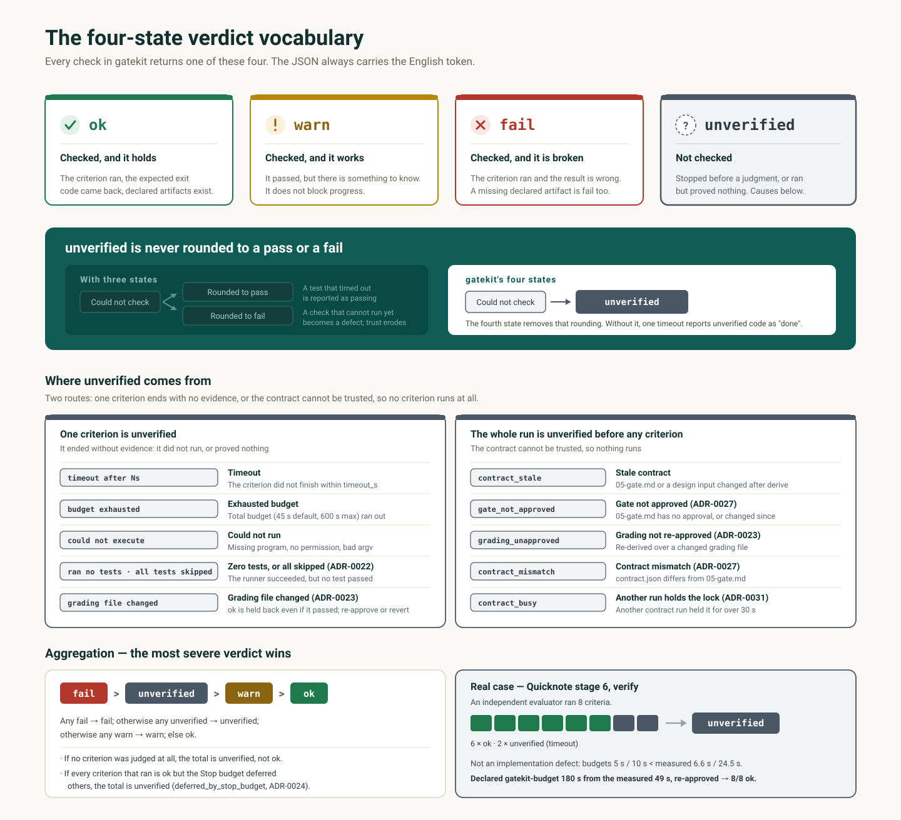

# Core concepts



## The four-state verdict vocabulary

Every check in gatekit returns one of `ok` / `warn` / `fail` / `unverified`. The JSON always carries these English tokens. Only the label shown on screen changes with the language.

| Value | Meaning |
|---|---|
| `ok` | Checked, and it holds |
| `warn` | Checked, and it works, but there is something to know |
| `fail` | Checked, and it is broken |
| `unverified` | **Not checked** |

The aggregation rule: if any result is `fail`, the total is `fail`; otherwise, if any is `unverified`, the total is `unverified`; otherwise, if any is `warn`, the total is `warn`; otherwise it is `ok`.

### Why four and not three

With a three-word vocabulary, "could not check" has to be rounded to either pass or fail. Round it to pass, and a test that timed out is reported as passing. Round it to fail, and a check that cannot run yet is reported as a defect, and trust erodes. The fourth state removes that rounding.

**Without it**: a single timeout reports unverified code as "done".

## The spec set

These are the documents under `spec/` that people review and commit.

| File | Contents | Required |
|---|---|---|
| `00-discovery.md` | Improvement opportunities found through free conversation, and their verdict (`build`/`reuse`/`eliminate`/`unknown`) | No |
| `01-prd.md` | Problem, measured current state, goals, features, acceptance criteria, assumption ledger | Yes |
| `02-screens.md` | Screen list, flow, states, components, tokens, areas with no evidence, the prototype confirmation record | No |
| `02-design.md` | Design patterns that cut across screens, component visual specs, a token summary | No |
| `03-architecture.md` | Stack, data model, identifiers, external integrations, constraints | No |
| `04-tasks.md` | The task list, written as `gatekit-task` fences | No |
| `05-gate.md` | The completion criteria, written as `gatekit-criterion` fences | Yes |
| `RECOVERY.md` | Diagnosis loop, retry limit, scope lock, rollback procedure | No |
| `PROGRESS.md` | Current state, milestones, failed attempts, last verification | No |
| `tokens.json` | Machine-readable design values such as colors, spacing and fonts. Shared and merged by `mockup` and `design` | No |

`heading-map.json` sets the H2 headings of each Markdown file, and they differ by language. If one file mixes headings from both languages, `spec validate` reports it as a failure.

**Without it**: the validator does not know what to look for, so it passes any document.

## The verdict gate

Each improvement opportunity in `00-discovery.md` carries two separate values: `verdict_suggested`, which the model proposes, and `verdict`, which the user confirms (`build`/`reuse`/`eliminate`/`unknown`). If the user-confirmed value is `eliminate` or `reuse`, `spec validate` reports `pain_verdict_blocks` and blocks `/gatekit:interview` — this filters out, before the interview, things that should not be built, or rebuilding something that already exists. `unknown` never blocks: if not having decided yet were itself a reason to block, deferring the decision would become the winning move, which is a paradox.

**Without it**: the whole interview, design and build go into an idea that has already failed or that already has a substitute.

## The prototype confirmation gate

For a project with a UI, `/gatekit:mockup` builds an actually clickable HTML prototype (`spec/design/prototype-<name>.html`), and goes back and forth with the user, who opens it and says what to change. Until the user explicitly confirms it, no `Prototype confirmed <date>` line appears in `02-screens.md`. Without that line, `spec validate` reports `prototype_required` and `/gatekit:tasks` refuses to proceed.

**Without it**: you see the real screens for the first time only after the build is finished, and by then it is too late to go back.

## The assumption ledger

This is the `## Assumption ledger` section of `spec/01-prd.md`. Every decision made without the user's confirmation goes here as a numbered row, and each place that actually uses that decision gets an inline marker with the same number.

```markdown
> ⚠️ Assumption 2: {{what you assumed}}
```

The numbers must match 1:1 between the inline markers and the ledger rows. `spec validate` checks this correspondence. An inline marker with no matching row is `fail`; a row with no matching marker is `warn`. A value that was not measured is not invented: it is written as "not measured" and put on the ledger.

**Without it**: decisions the AI made on your behalf mix into the document as if they were facts, and later nobody knows they were guesses.

## The completion contract

This is the set of `gatekit-criterion` fences in `spec/05-gate.md`, derived into `.gatekit/contract.json`. Each criterion consists of an argv list that runs without a shell, an expected exit code, its own timeout, and a list of artifacts.

`contract run` runs each criterion with the project root as the working directory. The total budget is 45 seconds by default, and a `gatekit-budget` fence can raise it up to 600 seconds. A timeout or an exhausted budget is `unverified`, never `ok`. A test runner that finishes successfully without running a single test is also `unverified` (ADR-0022). The same goes for a run where every collected test was skipped. If no test passed, nothing was proven. The verdict reason records `all tests skipped (<signature id>; exit N)`. If only some tests were skipped and the rest passed, the result is `ok` as usual. The passes must be visible in the runner output, though. In unittest, when skipped subTests hide the passes (only `s` and `OK (skipped=N)` are printed), the two cannot be told apart, so the result is `unverified` (ADR-0022 amendment A). The grading files a criterion's argv points to — the script run as argv[0], or a file that looks like a test (inside a directory such as `tests/` or `e2e/`, or named like `test_*`, `*.test.*`, `*.spec.*`) — get a hash recorded at `contract derive`, and that hash is pinned together with `05-gate.md` when you approve it. If such a file changes or disappears after approval, the criterion is `unverified` even if it passed, and deriving again does not clear it (`grading_unapproved`). If the change was intended, run `/gatekit:gate` again to re-approve; otherwise, revert the change. The following do not get this check: a source file under inspection, as in `grep … src/app.py`; spec files under the top-level `spec/`, such as `spec/tokens.json` and `spec/02-design.md` (in that folder, only files with test-shaped names like `user_spec.rb` count); build output such as `dist/`; and commands that point to no file or only to a directory or glob, such as `npm test`. If you want the check, name the test file in the argv (ADR-0023). A declared artifact that is missing is `fail`.

**Without it**: "done" exists only as the model's self-report.

## Hash-anchored approval

`.gatekit/approvals.json` records the target path and its SHA-256 at that moment.

| `approve check` result | Meaning |
|---|---|
| `ok` | The current file hash matches the approved hash |
| `fail` | The file changed after approval — the approval is stale |
| `unverified` | There is no approval record at all |

Rewriting a file back just to make the hash match is forbidden. A person has to approve again.

**Without it**: you could pass the gate by deleting the criteria that fail.

## Worker execution mode (`build.execution`)

`build.execution` in `.gatekit/config.json` decides who implements the tasks (ADR-0013). **The default is `host`** — the session running the build implements the tasks itself, in order, and after each task it runs that task's gates and writes `status.json`. Even then, the verdict comes from the gates, not from the implementer's self-report.

**Why workers are not the default**: a worker is a new session of the same model, so for every task it has to rediscover from scratch the project context this session already knows. In a measured case (`gk-trial2`), 26 minutes of actual work became **4.5 hours**, and most of the difference was the cost of 35 worker spawns each learning the project anew.

So a worker is spawned only **when the model actually has to differ** (adversarial verification, a Codex host delegating to Claude), or **when a round has enough independent tasks for parallelism to pay** — both are judged round by round, not set by this default. To always use workers as before, set `"execution": "worker"` explicitly.

It is fine if a long build compacts the session — task state and gate results all live in files, and the PreCompact hook stamps progress into `spec/PROGRESS.md` right before compaction, so the returning session reads that file and continues.

**Without it**: instead of using the session that already has the context, a new process that knows nothing is spawned for every task and made to work everything out again.

## The session ledger

This is `.gatekit/runs/<session_id>.json`. It holds the output language, the active pipeline, the question budget, the declared write scopes, the number of Stop gate blocks, and the final verdict. It is written atomically and looked up only by `session_id`. There is no fallback lookup such as "the most recent file". `events` is append-only, and past 500 entries the oldest are dropped first.

**Without it**: the gates each decide alone, unaware of each other's decisions.

## write_scope

A list of file globs a task may write, or the string `"read-only"`. It is used in two places.

- It is declared for each task in `spec/04-tasks.md`, and inside a worker session the write gate enforces it based on the `GATEKIT_TASK_ID` environment variable.
- It is declared in a `gatekit-scope` fence when a subagent is spawned, and the spawn gate checks whether it overlaps a scope that is already active.

If two tasks in the same round have overlapping scopes, `spec validate` reports `fail`. Do not widen a scope to get rid of a conflict. Split the round or re-cut the tasks.

**Without it**: parallel workers silently overwrite each other's files.

## output_lang auto-detection

`lang.detect(text)` counts the Hangul syllables and jamo and the Latin letters in a text. If Hangul makes up 30% or more of all letters, it returns `ko`; otherwise `en`. Empty text is `en`.

The prompt gate stores this value in the session ledger on every prompt, and the commands read it from the ledger. Every user-facing string (chat, `AskUserQuestion` labels, files under `spec/`) goes out in this language. Identifiers are never translated. Only `ko` and `en` templates exist; any other language falls back to the `en` template, and the command says so once. An empty prompt carries no language signal, so the stored value is kept.

**Without it**: you ask in Korean and the spec documents come out in English.
