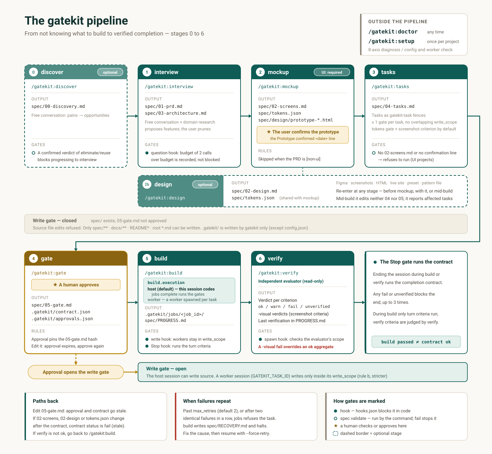

# The pipeline end to end



## The full diagram

```text
                    [ /gatekit:doctor ]  ← any time. 8-axis install/state diagnosis
                    [ /gatekit:setup  ]  ← once per project. config and worker check
                              │
   don't know what to build   ▼
        │            ┌───────────────────┐
        └───────────▶│ 0. discover (opt.)│──▶ spec/00-discovery.md
                     │  free conversation│    (verdict gate)
                     └───────────────────┘
                              │
   problem is chosen          ▼
        │            ┌───────────────────┐
        └───────────▶│ 1. interview      │──▶ spec/01-prd.md
                     │  conversation +   │    spec/03-architecture.md
                     │  research         │
                     └───────────────────┘
                              │
                              ▼
                     ┌───────────────────┐
                     │ 2. mockup         │──▶ spec/02-screens.md
                     │ ★ confirm the     │    spec/tokens.json
   pattern/reference │   prototype       │    spec/design/prototype-*.html
   site              └───────────────────┘
        │                     │
        │            ┌───────────────────┐
        └───────────▶│ 2b. design (opt.) │──▶ spec/02-design.md
                     │  (re-enter at any │    spec/tokens.json (shared with mockup)
                     │   stage)          │    gap rows added to 01's assumption ledger
                     └───────────────────┘
                              │
                              ▼
                     ┌───────────────────┐
                     │ 3. tasks          │──▶ spec/04-tasks.md
                     └───────────────────┘    (gatekit-task fences)
                              │
                              ▼
                     ┌───────────────────┐
                     │ 4. gate           │──▶ spec/05-gate.md
                     │  ★ human approval │    .gatekit/contract.json
                     └───────────────────┘    .gatekit/approvals.json
                              │
              [the write gate opens here]
                              │
                              ▼
                     ┌───────────────────┐
                     │ 5. build          │──▶ .gatekit/jobs/<job_id>/
                     │ host (default) →  │    spec/PROGRESS.md
                     │   this session    │
                     │ worker → spawned  │
                     │   workers         │
                     └───────────────────┘
                              │
                              ▼
                     ┌───────────────────┐
                     │ 6. verify         │──▶ independent evaluator verdict (+ -visual)
                     │ producer≠evaluator│    spec/PROGRESS.md last verification
                     └───────────────────┘
                              │
                [the Stop gate runs the contract]
```

## Input, output and gates per stage

| Stage | Command | Input | Output | Related gates |
|---|---|---|---|---|
| 0 | `/gatekit:discover` | Nothing is needed. Free conversation | `00-discovery.md` | `spec validate` blocks a confirmed verdict of `eliminate`/`reuse` as `pain_verdict_blocks`. Optional stage |
| 1 | `/gatekit:interview` | The improvement opportunity discovery chose (if any), the existing repo | `01-prd.md`, `03-architecture.md` | Free conversation plus domain research (`WebSearch`) proposes features, and the user prunes them |
| 2 | `/gatekit:mockup` | A Figma URL, HTML, screenshots, or a design preset | `02-screens.md`, `tokens.json`, the confirmed prototype | `prototype_required` clears only when the user confirms the prototype |
| 2b | `/gatekit:design` | A Figma URL, screenshots, HTML, a live site URL, a preset name, a user pattern file | `02-design.md`, `tokens.json` (shared), ledger gap rows | The question gate. If `spec/tokens.json` exists, `tasks` adds a tokens gate to style-related tasks by default |
| 3 | `/gatekit:tasks` | `01`, `02`, `02-design`, `03`, the actual repo structure | `04-tasks.md` | Refuses to run if `02-screens.md` has no prototype confirmation record |
| 4 | `/gatekit:gate` | The acceptance criteria in `01`, the tasks in `04` | `05-gate.md`, `contract.json`, approval | Approval opens the write gate |
| 5 | `/gatekit:build` | `04-tasks.md`, the approved `05-gate.md` | The job directory, `PROGRESS.md` | The write gate enforces `write_scope`. UI tasks require a screenshot artifact. If `build.execution` is `host` (the default), this session implements the tasks itself; if `worker`, a worker is spawned per task (ADR-0013) |
| 6 | `/gatekit:verify` | `contract.json`, `05-gate.md` | The verdict table (code criteria + `-visual`), the last verification in `PROGRESS.md` | The spawn gate checks the evaluator's scope; the stop gate runs the contract |

`doctor` and `setup` are not part of this sequence. Run `setup` once per project, and `doctor` any time you suspect a problem.

Unlike the other stages in this table, `/gatekit:design` has no fixed place in the order. You can run it before the mockup, together with the mockup, or even during `build`. When it runs during `build`, it does not edit `04-tasks.md` or `05-gate.md` directly; it only reports the list of affected tasks — redelegation has to go through `/gatekit:tasks` and `/gatekit:gate` again. If any of `02-screens.md`, `02-design.md` or `tokens.json` changes after the contract was derived, `contract status` returns `fail` (stale).

## What blocks at each stage

### Before stage 1

While there is no `spec/` directory yet, the write gate blocks nothing. Rule (a) fires only when `spec/` exists.

### During stages 1 to 3

`spec/` now exists and `05-gate.md` is not approved, so the write gate refuses edits to source files. Only `spec/**`, `.gatekit/**`, `docs/**`, `README*` and `*.md` at the root can be written. Without this allowlist, you could not write the very spec that opens the gate.

### At the stage 4 approval

When the user reads and approves `05-gate.md`, its hash is pinned. From that moment, write gate rule (a) passes and source files can be written. At the same time, the Stop gate takes this contract as the thing it runs.

### During stage 5

A worker session has `GATEKIT_TASK_ID` set, and write gate rule (b) fires. Rule (b) is stricter than (a): it has no documentation allowlist. A worker assigned `src/auth/**` cannot edit the PRD.

### Stage 6 and the end

Even if every task in `build` is `passed`, that is not the same as passing the completion contract. Only `verify` reports that. When you try to end the session, the Stop gate runs the contract, and if anything is `fail` or `unverified`, it blocks the session from ending, up to 3 times.

## Paths back

- Editing `05-gate.md` makes the approval stale and the contract stale. You have to run `contract derive` and approve again.
- If a task fails 3 times in a row, `build` stops redelegating, writes a diagnosis to `spec/RECOVERY.md`, and halts the pipeline. It does not fix the code itself.
- If `verify` is not `ok`, it lists what has to change and stops. Fixes go back through `/gatekit:build`.
