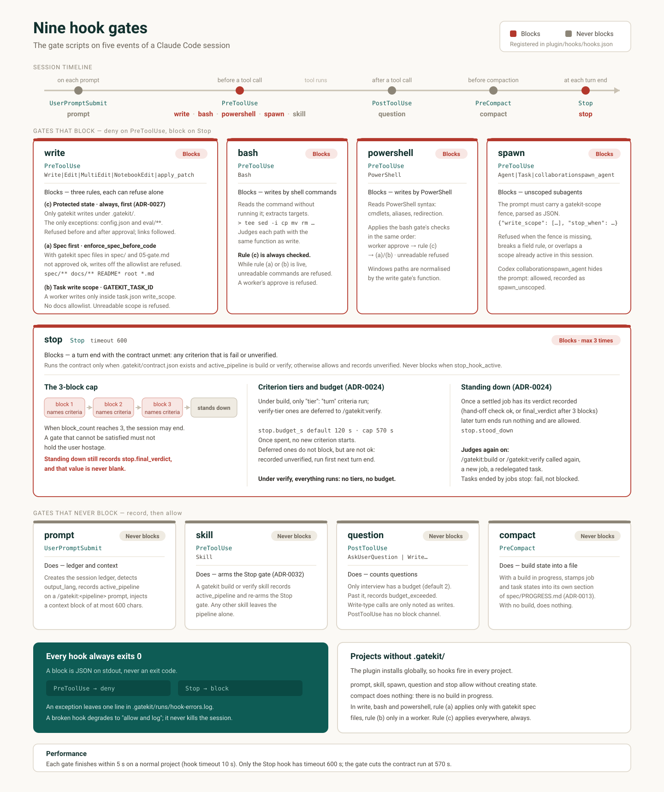

# Hook gates

`plugin/hooks/hooks.json` registers nine scripts. Claude Code reads this file automatically, and it is not listed in `plugin.json`. A duplicate reference makes the plugin fail to load. Separately, the `tokens` gate is not a hook: it is a task gate that a task in `spec/04-tasks.md` declares (see its own section below).

| Gate | Event | Target tools | Blocks? |
|---|---|---|---|
| prompt | `UserPromptSubmit` | none | No |
| write | `PreToolUse` | `Write`, `Edit`, `MultiEdit`, `NotebookEdit`, `apply_patch` | Yes |
| bash | `PreToolUse` | `Bash` | Yes |
| powershell | `PreToolUse` | `PowerShell` | Yes |
| skill | `PreToolUse` | `Skill` | No (it only arms the Stop gate) |
| spawn | `PreToolUse` | `Agent`, `Task`, `collaborationspawn_agent` | Yes |
| question | `PostToolUse` | `AskUserQuestion`, `Write`/`Edit`/`MultiEdit`/`NotebookEdit` | No (there is no channel) |
| compact | `PreCompact` | none | No |
| stop | `Stop` | none | Yes (at most 3 times) |



## prompt gate

**When**: every time the user sends a prompt.

**What it does**: creates or loads the session ledger, detects `output_lang` from the prompt text, and stores it. In a session that has only had prompts with no detectable language, such as `/gatekit:build` with no arguments, it decides the language from the first 40 body lines of `spec/01-prd.md` (or `spec/00-discovery.md` if that file is missing). YAML front matter, code blocks, table rows, and inline code are often English, so they are not counted; only heading, paragraph, and list lines count. When a later prompt reveals a language, that prompt wins, and the session does not look at the spec again (ADR-0026). If the prompt is a `/gatekit:<pipeline>` call (Claude Code passes a slash command as the body of a `<command-name>/gatekit:build</command-name>` tag), the gate records that value as the ledger's `active_pipeline` (`doctor` and `setup` clear it). The stop gate and the question budget read this value, so the pipeline is recorded in code by this gate, not by command prose. When you move to another pipeline, the question budget counts from 0 again. Finally, the gate injects a context block of at most 600 characters into the conversation. The block holds the output language, the active pipeline, question budget usage, the gate approval state, and the contract state.

**Block**: never.

**Note**: an empty prompt carries no language signal, so the stored language stays as it is. Sending a single blank line does not switch the language to English.

## write gate

**When**: just before a `Write`, `Edit`, `MultiEdit`, or `NotebookEdit` call.

There are three independent rules, and each one can refuse a write on its own. The protected-state rule (c) applies first, always.

### Rule (c) protected state — only gatekit writes `.gatekit/` (ADR-0027)

Everything under `.gatekit/` except `config.json` (user settings) and `eval/**` (evaluator scratch) is written by gatekit itself. This covers the approval record (`approvals.json`), the contract (`contract.json`), the last verdict record (`runs/contract-last.json`), session ledgers (`runs/<session_id>.json`), job directories (`jobs/`), `attempts.json`, `baseline.json`, and `runs/hook-errors.log`. Hooks and the CLI (`approve`, `contract derive`, `jobs …`) write these files in-process, not through tool calls, so this rule does not catch them. Any other write is refused: `Write`, `Edit`, `MultiEdit`, `NotebookEdit`, and `apply_patch` alike, before or after approval, in any session, regardless of `GATEKIT_TASK_ID` or `enforce_spec_before_code`. Paths are compared case-insensitively, after turning `\` into `/` and stripping NTFS stream suffixes (`::$DATA`) and trailing dots and spaces, both as written and as the realpath. Symbolic links and (when the target exists) hard links are followed too. Another project's `.gatekit/` is protected as well. Reads (`Read`, `cat`, `jq`) are not blocked.

This rule exists because hand-writing the approval record, or the verdict record the Stop gate reuses, would open the gate without the user or let Stop pass without a verdict.

**What to do when blocked**: to change criteria or the gate, run `/gatekit:gate` again. Change settings in `config.json`. To delete gatekit state, uninstall the plugin first and delete it yourself in a terminal (`UNINSTALL.md`). Clean up old jobs with `python3 "${CLAUDE_PLUGIN_ROOT}/bin/gatekit.py" jobs clean`.

### Rule (a) spec first

If `enforce_spec_before_code` is on, `spec/` holds one of gatekit's spec files, and the approval of `spec/05-gate.md` is not `ok`, writes outside the allowlist below are refused. A `spec/` that holds none of gatekit's spec files — an RSpec project's `spec/`, or an empty one — does not count (ADR-0036).

```text
spec/**
.gatekit/**
docs/**
README*
*.md   (root level only)
```

This allowlist exists because you must be able to write the very spec that opens the gate. `.gatekit/**` is on the list, but rule (c) is checked first, so of the state directory only `config.json` and `eval/**` can actually be written before approval.

**What to do when blocked**: run `/gatekit:gate` to create the completion criteria and have the user approve them. If it is urgent, write to `spec/`, `docs/`, or root-level Markdown first. The block message shows the current approval state (`fail` or `unverified`) and the blocked path.

### Rule (b) task write scope

When the `GATEKIT_TASK_ID` environment variable is set — that is, inside a worker session launched by the job runner — you can write only inside the `write_scope` listed in that task's `task.json`. Rule (b) is stricter than (a): it has no documentation allowlist. A worker assigned `src/auth/**` has no reason to rewrite the PRD.

It refuses in four cases.

| Situation | Message key |
|---|---|
| Path outside the project root | `outside_root` |
| `task.json` cannot be read, so the scope cannot be checked | `scope_missing` |
| The scope is `"read-only"` | `scope_read_only` |
| Path not in the scope | `scope` |

If the scope cannot be checked, the write is refused. A worker that claims a task id whose scope cannot be established gets no write access.

**What to do when blocked**: inside a worker, you have left that task's scope. This is a sign that the task breakdown in `04-tasks.md` is wrong. Do not widen the scope; slice the task again.

## bash gate

**When**: just before the `Bash` tool runs.

**What it does**: it reads the command string without running it, extracts the files the command will write, and judges each path with the **same function** as the write gate. It recognizes redirection (`>`, `>>`, `&>`), `tee`, `sed -i`, `perl -i`, the destination of `cp`/`mv`/`ln`/`install`/`rsync`, the targets of `touch`/`rm`/`mkdir`/`truncate`/`chmod`/`chown`, `dd of=`, and tools whose output path appears directly in the arguments, such as `sort -o`, `curl -o`, `wget -O`, `tar -C`/`-f`, `unzip -d`, and `zip`. It tracks `cd` across `;`, `&&`, `|`, and newlines, strips `VAR=`, `sudo`, `env`, and `nohup` prefixes, ignores heredoc bodies and `/dev/*`, and reads `sh -c "…"` recursively.

**When the rules are off**: in a state where rules (a) and (b) cannot refuse (no `GATEKIT_TASK_ID`, and the gate is approved or `spec/` holds no gatekit spec file), the command is still read, but only the protected-state check below judges the result. Everything else passes without a verdict. The reading is static and light, so a normal session feels no cost.

**Undeterminable means refused**: when the rules are live and the write target cannot be determined, the command is refused. This covers `$VAR` or backticks inside a path, `cd` into an unknown directory, `eval`, `xargs`, `patch`, `trap`, `find -exec`, `git` subcommands that change the working tree (`apply`, `checkout`, `restore`, `reset`, `merge`, `stash`, `init`, `clone`, and so on), inline interpreter code (`python3 -c`, `node -e`), interpreters that take a script on standard input (`python3 <<PY`, `echo … | node`, `python3 < s.py` — not when a script file or `-m module` is in the arguments), `awk`, command-line editors (`ed`, `ex`, `vim`, `nano`), `busybox`, downloads that pick their own file name (`curl -O`, `wget` with no option), process substitution, and unbalanced quotes. The refusal message gives the reason and an alternative (the Write/Edit tools, a literal path). It is the same principle as never rounding `unverified` up to `ok`.

**Protected state (ADR-0027)**: every command is read against rule (c). The command is refused if: its write target is gatekit state; it deletes or moves that state, or a directory that contains it, with `rm` or `mv` (`rm -rf .gatekit`, `rm -rf .gatekit/runs`); it copies, moves, or links anything other than `config.json` or `eval` into `.gatekit/` (`cp x .gatekit/`, `cp -R src/ .gatekit`); `ln` (including `cp -l`/`-s`) points at gatekit state or a directory that contains it; the path of `git checkout`/`restore`/`reset`/`stash push` is that state or the `.gatekit` directory (`git checkout -- .gatekit`); the extract directory of `tar -C` or `unzip -d`, or the starting point of `find -exec`/`-delete`, is that state; the path is built from a variable set earlier to hold `.gatekit` (`d=.gatekit; echo x > $d/approvals.json`); or the body of an undeterminable command names a `.gatekit` path (including the body of `python3 <<PY`) or runs inside `.gatekit`. Globs and braces, `cd` after shell reserved words, `pushd`, and conditional `cd` are taken into account too. Allowed: reads such as `cat`/`jq`/`grep`/`diff`/`ls`/`python3 -m json.tool`; `git diff`/`log`/`show`/`add`/`commit`/`status`; backing `.gatekit` up to somewhere outside with `tar -czf`, `zip -r`, `rsync -a .gatekit/ …`, or `cp -a .gatekit …`; `mkdir .gatekit`; writes under `.gatekit/eval/`; editing `config.json`; and the launcher commands (`approve`, `contract derive`, `contract run`, `jobs …`). `git checkout -- .`, `git reset --hard`, `git stash pop`, and `git clean -fdx` restore or remove committed state, so they stay on the trust boundary. When an undeterminable command writes without naming the path (a path joined from strings, a script file, an archive extracted at the root), static reading cannot see it. The Stop gate's integrity check blocks the effect (below).

**The state directory itself (ADR-0029 amendment)**: only gatekit creates, changes, links, or renames into place a path whose last component is a state directory name (`.gatekit`, `.gatebound`, regardless of case or Windows spelling). So `ln -s /tmp/x .gatebound`, `mv forged .gatebound`, `mv eval .gatebound`, `cp -r x .gatebound`, `touch .gatebound`, `install -d .gatebound`, `mkdir .gatebound`, and writing a `.gatebound` file with the Write tool are always refused, before or after approval. Two things are left allowed: a plain `mkdir` of the **current name** (`.gatekit`), only when no other state directory exists under the same parent; and copying **into** an existing state directory (`cp config.json .gatekit/`, judged by the copy rule above). `/gatekit:setup` has the CLI create the directory in-process, so this rule does not catch it. If a forged directory appears anyway (from extracting an archive, say), the hooks do not read it: they ignore a candidate that is a link or junction or whose real path is not directly under the project root; if a directory with the current name exists, they always use the current name even when the other one holds `approvals.json`; and if both directories hold `approvals.json`, the Stop gate judges neither and blocks with `unverified` (chapter 10).

**64 KB cap (ADR-0028 amendment)**: a command larger than 64 KB (UTF-8) is not read. When a hook exceeds its time limit (10 seconds), Claude Code does not block; it just runs the command. So input that cannot be read to the end is not read at all. When the rules are live (always, for a worker), the command is refused as undeterminable. When the rules are off, a single scan checks only for mentions of protected state: if the command names gatekit state (other than `config.json` and `eval/`), it is refused; otherwise it is allowed. This means that even after approval, a command over 64 KB can be refused just for mentioning `.gatekit`. Write large content to a file with the Write tool and run it with a short command. The powershell gate uses the same cap.

**Limits**: it does not look at what a program invoked by name (`npm run build`, `python3 script.py`) writes. It is a gate that reads shell syntax, not one that knows the behavior of every binary. The rationale is in `docs/decisions/ADR-0004-bash-write-gate.md`.

**One exception — workers do not approve**: when the hook environment has `GATEKIT_TASK_ID` (a worker session), a command that runs gatekit's own `approve` subcommand is refused before any other rule. This closes the route of dodging `approve`'s refusal by removing the environment variable, as in `env -u GATEKIT_TASK_ID python3 …/gatekit.py approve spec/05-gate.md`. It looks for `approve` after `gatekit.py`, `gatekit`, `-m gatekit`, or `-m gatekit.cli`, and for `-m gatekit.approval` (and the same with the new name `gatebound`), in every simple command, after `env`/`VAR=` prefixes, inside `sh -c` and `eval` strings, and even with quoted paths or `${CLAUDE_PLUGIN_ROOT}`; when lexing fails, it matches by pattern. `approve check` and `approve list` are allowed. The rationale is ADR-0023.

## powershell gate

**When**: just before Claude Code's `PowerShell` tool runs. On Windows, when this tool is enabled, PowerShell is the default shell (without Git Bash, the `Bash` tool is not registered at all), and calls to this tool do not match the `Bash` matcher. The tool name is `PowerShell` and the command string is `tool_input.command` (per the official hooks documentation).

**What it does**: it applies the **same verdicts** as the bash gate, in the same order — refusing a worker's `approve`, protected state (rule (c), always, before or after approval), and, only while the rules are live, rules (a) and (b) and the undeterminable refusal. The only difference is how it reads the command. It reads PowerShell syntax without running it: it splits statements on newlines, `;`, `&&`, `||`, and `|`, and reads `'…'` (`''`), `"…"` (backtick escapes, `""`), here-strings `@'…'@` and `@"…"@`, backtick line continuation, `#` and `<# #>` comments, and typographic quotes and dashes the way PowerShell does. Redirections `>`, `>>`, `2>`, `*>`, and `*>>` are writes (`2>&1` and `$null` are not). Cmdlet and parameter names are case-insensitive. It resolves module prefixes (`Microsoft.PowerShell.Management\Remove-Item`) and the default aliases (`sc`, `ac`, `ni`, `md`, `cp`/`copy`/`cpi`, `mv`/`move`/`mi`, `rm`/`del`/`ri`/`rd`, `ren`, `tee`, `iex`, `cd`/`sl`, `pushd`/`popd`, and so on), and binds parameter prefix abbreviations (`-Pa` is `-Path`), `-Path:value`, positional arguments, and comma arrays per cmdlet. Recognized writes: `Set-Content`, `Add-Content`, `Clear-Content`, `Out-File`, `Tee-Object -FilePath`, `New-Item` (including `-Name` and the target of a symbolic link, hard link, or junction), `Copy-Item`, `Move-Item`, `Remove-Item`, `Rename-Item`, `Set-Item`, `*-ItemProperty`, `Set-Acl`, `Export-*`, `Start-Transcript`, `Compress-Archive`, `Expand-Archive`, `Invoke-WebRequest -OutFile`, `Start-Process -RedirectStandardOutput`, and `[IO.File]::WriteAllText`, `AppendAllText`, `WriteAllBytes`, `Copy`, `Move`, `Delete`, and so on with literal arguments. It tracks the current location through `Set-Location`, `Push-Location`, and `Pop-Location`, and normalizes Windows paths (backslashes, drive letters, the `\\?\` prefix, `FileSystem::`, `::$DATA`, trailing dots and spaces, case) with the same function as the write gate. Non-file paths such as `Env:`, `Variable:`, and `HKLM:` are not writes. Script blocks `{…}` and `(…)`/`$(…)` (including inside double quotes) can run, so they are read as code; `iex` on a literal string and `pwsh -Command "…"` are read recursively, and `-EncodedCommand` is decoded and read (and also marked undeterminable). Native programs are handed to the bash gate's simple-command analysis as they are, so `git`, `tar`, `python -c`, `node -e`, interpreters that take code through a pipe, and `bash -c '…'` are judged as they are in bash. `Rename-Item` and `Move-Item` are recorded as a move like `mv` (removing the original path plus copying to the new name), and `New-Item -ItemType SymbolicLink|Junction|HardLink` as copying the target to the link path, so `New-Item -ItemType Junction -Path .gatebound -Value C:\tmp\forged` and `Rename-Item forged -NewName .gatebound` are refused exactly like bash's `ln -s` and `mv` (see "The state directory itself" above).

**Undeterminable means refused**: while the rules are live, it refuses variables, subexpressions, and splats (`@params`) inside a path; paths coming from the pipeline (`Get-ChildItem | Remove-Item`); an unknown parameter of a write cmdlet; an unknown current location; `& $cmd`; `cmd /c`; `wsl`; `Start-Process` that launches a shell or interpreter; `iex` on something other than a string; `Add-Type`; `Set-Alias`; COM objects (`New-Object -ComObject`); I/O and network .NET types; reflection; instance methods that can write (`.Delete()`, `.MoveTo()`, `.Save()`, and so on); `--%`; `using namespace`; static calls with a computed type or a quoted member name; `[Environment]::CurrentDirectory`; calling a write method through `ForEach-Object`/`%` (`| % Delete`); `Alias:` and `Function:` paths; `New-PSDrive` and `subst`; and commands that run a script along with a write (`Set-Content x.ps1 …; & ./x.ps1`). PowerShell wildcards also match names that start with a dot, so `Remove-Item *` is treated as deleting `.gatekit`. After approval, as in bash, only the protected-state check remains — the command is refused if the body of an undeterminable command (with quotes, backticks, and `+` concatenation stripped, including a decoded `-EncodedCommand` and 8.3 short names such as `GATEKI~1` and `GATEBO~1`) names a `.gatekit` or `.gatebound` path.

**Workers do not approve**: when `GATEKIT_TASK_ID` is present, it finds and refuses `approve` inside `Remove-Item Env:GATEKIT_TASK_ID; python …\gatekit.py approve …`, `& python "$env:CLAUDE_PLUGIN_ROOT\bin\gatekit.py" approve …`, `pwsh -Command "…"`, and `Start-Process python -ArgumentList …`. `approve check` and `approve list` are allowed.

**Limits**: it does not look at what programs and scripts invoked by name (`.\build.ps1`, `npm run build`) write. Paths assembled at run time (`-join`, `-f`, `[char]` codes, Base64) are refused before approval but allowed after approval unless they name `.gatekit`. The same goes for COM, .NET, and reflection routes outside the list above, and for cmdlets that modules provide. A skill's `` !`command` `` lines do not pass through the PreToolUse hook, so this gate does not see them (the matcher on the `Skill` tool belongs to the skill gate below and does not inspect commands). Codex reports every shell call as `Bash`, so the Codex layer has no matching hook. Behavior in a real Windows session has not been observed yet (the tests verify parsing only). The rationale is in `docs/decisions/ADR-0028-powershell-tool-gate.md`.

## skill gate

**When**: just before a skill is loaded through the `Skill` tool.

**What it does**: if the skill is gatekit's `build` or `verify` (the command `gatekit:build` or the trigger skill `gatekit:gatekit-build` alike), it records `active_pipeline` in the session ledger and re-arms the Stop gate, exactly as typing the command does (ADR-0032). For any other skill it does nothing. It also does nothing in a project without `.gatekit/`.

**Why it is needed**: the Stop gate runs the contract only while `active_pipeline` is `build` or `verify`, and originally only the prompt gate recorded that value. So when the same command started through the `Skill` tool — the model continuing into `/gatekit:verify` after a build, or a trigger skill run by "start the build" — the Stop gate stayed idle and the session could end unverified.

**Scope**: it only arms. Through a tool call the model may start the gate's judging, but never stop it or move a running build to a pipeline the Stop gate does not judge. Turning it off or switching stays with commands the user types.

**Block**: never.

## spawn gate

**When**: just before a subagent is launched with `Agent` or `Task`. Codex's `collaborationspawn_agent` does not show the prompt to the hook, so it is allowed and recorded as `spawn_unscoped`; that agent's writes still meet the write and bash gates.

**What it requires**: the spawn prompt must contain a `gatekit-scope` fence, and its contents must be a valid JSON object.

```json
{"write_scope": ["src/auth/**"], "stop_when": "tests pass", "tools": "inherit"}
```

| Field | Rule |
|---|---|
| `write_scope` | A non-empty list of glob strings, or exactly `"read-only"` |
| `stop_when` | A non-empty string. Required |
| `tools` | A list or the string `"inherit"`. Default `"inherit"` |

`stop_when` is required because an agent that never stated its stop condition cannot be checked against it.

**When it refuses**: the fence is missing, it is not JSON, a field rule is violated, or the declared scope overlaps a scope already active in this session.

**Key design**: the fence is **parsed as JSON**; no regex runs over prose. A prompt that merely mentions `write_scope` in a sentence does not satisfy the gate. An agent cannot talk its way around enforcement.

**What to do when blocked**: add the fence. On a scope conflict, narrow the scope or wait until the earlier agent finishes. The message names the owner of the overlapping scope.

## question gate

**When**: right **after** `AskUserQuestion` runs.

**What it does**: counts the `AskUserQuestion` calls (the pop-up where you pick from options) in the session. Only the `interview` pipeline has a budget, 2 calls by default, set with `questions.interview_max_calls`. Other pipelines are unlimited. When the budget is exceeded, it records `budget_exceeded` as true.

**Block**: never. `PostToolUse` has no blocking channel. Pretending to block would be prose enforcement.

**Then what good is it?**: the flag is informational, and the command reads it and changes its own behavior. To go over the `AskUserQuestion` budget, the command must leave one line on "what it would write differently depending on this answer"; if it cannot write that line, it writes an assumption to the ledger instead of asking.

**What this budget does not cover**: the free conversation in `discover` and `interview` (Step 2, the part that asks one thing at a time in plain chat) never uses `AskUserQuestion`, so this gate does not apply to it — it continues with no count limit as long as the conversation keeps producing something new. This gate counts only the decision questions that pop up asking the user to pick an option.

## compact gate

**When**: just before the conversation is compacted.

**What it does**: if a build running with `build.execution: host` is in progress, it stamps the job id, the execution mode, and each task's state and gate pass count into a fixed section of `spec/PROGRESS.md` (ADR-0013). If no build is in progress, it does nothing.

**Why it is needed**: in `host` mode this session implements the tasks itself, so even when compaction erases the conversation's narrative, task states and gate results are already in files. This gate stamps that file-based state explicitly once more just before compaction, so the session that comes back after compaction continues by reading the file, not its memory of the conversation.

**Block**: never. It rewrites only its own section as a whole and leaves other content alone.

## stop gate

**When**: when the session is about to end.

**Trigger condition**: it runs the contract only when `.gatekit/contract.json` exists and the session ledger's `active_pipeline` is `build` or `verify`. Otherwise it lets the session end.

**Standing down (ADR-0024)**: under `build`, it judges while the latest job is missing or unfinished, and judges once more after every task has reached a terminal state (the hand-off check). Once a verdict is recorded for that finished job — the hand-off check is `ok`, or `final_verdict` is recorded after three blocks — the gate stands down. After that, at the turn ends of the same session, it runs no criteria at all and lets the turn end at once. This is recorded in the ledger's `stop.stood_down` (the `stop_stood_down` event), and the prompt gate's context line announces "stop gate stood down" together with what was judged (under `build`, "turn-tier ok"; if there are `verify`-tier criteria, "N deferred to /gatekit:verify") and "follow-up edits are not gated; /gatekit:verify re-checks the contract". The `contract=` field on the same line also gets the scope of that run appended when the last recorded result is for the current contract and the current code tree and did not judge every criterion. Example: `contract=ok (last run: turn tier, 1 deferred to /gatekit:verify)`, or `N unjudged` if the Stop budget cut it short. If you have edited files since then, or the record has no scope, nothing is appended. `contract=ok` on its own means only that the contract matches the approved gate file, not that everything was verified. The parentheses state only the scope, never that run's verdict (ADR-0026). Calling `/gatekit:build` or `/gatekit:verify` again resets everything down to the block count and judges again. It also judges again when a new job starts or a task is redelegated. A job with tasks left `queued` never finishes, so judging continues every turn. In that case the context line says "build job unfinished: N tasks queued — `jobs stop` ends judging"; end the job with `jobs stop`. `verify` works the same way (minus the job condition). For a job with failed tasks left, the hand-off check is not `ok` even if the contract is `ok`. If there are `failed`, `timeout`, or `blocked` tasks, it names those tasks and blocks up to three times, then records `final_verdict` (`fail`, or `unverified` if they are only `blocked`) and stands down. A task stopped with `jobs stop` (`stopped`) is recorded as `fail`, but the gate does not block; it stands down at once, because the job was ended on purpose.

**Criterion tiers and budget (ADR-0024)**: under `build`, only `"tier": "turn"` criteria run. `"tier": "verify"` criteria appear by name only, as "deferred to /gatekit:verify" in the block message; they are not judged, so they neither block nor report as `ok`. Also, once `stop.budget_s` in `.gatekit/config.json` (default 120 seconds, cap 570 seconds) has elapsed, no new criterion starts. Criteria that could not start appear as "deferred: Stop-gate budget" and are not a reason to block. They were not judged, though, so they are not `ok` either. Even if every criterion that ran passed, that turn end passes without a block (and without raising the block count) but is recorded as `unverified` (reason `deferred_by_stop_budget: <id>`), and the gate does not stand down. At the next turn end, the deferred criteria run first, and if the files are unchanged, the earlier run's verdicts carry over. So as long as you leave the files alone, everything is judged within as many turns as there are turn-tier criteria, and only then does the gate stand down. The names of unjudged criteria also appear on the prompt gate's context line. A record cut short by the budget is never reused (including `verify`'s Stop). A `fail` from a criterion that did run, and an `unverified` from a criterion that ran but timed out or found zero tests, still block as before. The deferred criteria are all run by `/gatekit:verify`'s `contract run` under the contract's own budget. Under `verify`, everything runs, with no tiers and no Stop budget. If there are no `turn` criteria at all, the Stop gate judges nothing during the build, so `spec validate` warns and the prompt gate's context line says so too.

**Block condition**: the contract run has at least one `fail` or `unverified` criterion, `block_count` is below 3, and `stop_hook_active` is not true. The block message lists the failed criteria, and `block_count` goes up by 1.

If the contract is stale, a different message goes out: it tells you to run `contract derive` and finish the work. If another contract run (an evaluator's or a `contract run`) held the lock for 30 seconds, the result is `unverified` with nothing judged and nothing recorded (`contract_busy`, ADR-0031), and the message says so: this is neither a failure nor a pass — wait for that run to finish, then end the turn again.

**Integrity check (ADR-0027)**: before running any criterion, and before reusing an earlier verdict record, it checks three things in order: `contract_stale` (above); `gate_not_approved` (`approve check spec/05-gate.md` is not `ok` — there is no approval, the file changed after approval, or a pinned grading file differs from the contract); and `contract_mismatch` (re-parsing `05-gate.md` in memory gives a result that differs from `contract.json` in any criterion field, the order, or the budget). If any one of them trips, the result is `unverified` with no criteria, and it blocks like any other `unverified`. `contract run` performs the same checks (`contract baseline` runs before approval, so it skips only the approval check). The verdict record `runs/contract-last.json` also stores the hash of the `contract.json` of that moment (`contract_sha256`); if the hash differs or is missing, the record is not reused.

**What `enforce_spec_before_code: false` leads to**: this setting turns off rule (a) only. In a project that has never approved, the Stop gate of the `build` and `verify` pipelines now returns `gate_not_approved`. Not judging criteria nobody agreed to is the honest verdict. `/gatekit:gate` always approves before `/gatekit:build`, so the normal flow is not affected.

### Release rule after three blocks

When `block_count` reaches 3, the gate stands down and lets the session end. A gate that cannot be satisfied must not hold the user hostage. Even while standing down, though, it records the fact that the session did not pass. `stop.final_verdict` holds the real verdict, and that value is **never blank**. A contract that never ran is recorded as `unverified`, not as a silent success.

When `stop_hook_active` is true — meaning Claude Code is already inside a chain of consecutive stop hook runs — blocking again would make a loop, so the gate always lets the session end. Even then it runs the contract and records the result.

**What to do when blocked**: fix the cause of the criteria named in the message and run the contract again. When `unverified` is the cause, it is usually a timeout; the proper fix is to measure and then declare `gatekit-budget`. If the reason is `ran no tests`, the test runner found no tests at all; if it is `all tests skipped`, it skipped every test it found (ADR-0022 amendment A). Neither proved anything, so neither counts as a pass.

## tokens gate (a task gate, not a hook)

**When**: not as a hook, but when a task in `spec/04-tasks.md` declares this gate in its `gates` list. If `spec/tokens.json` exists, `/gatekit:tasks` adds it by default to tasks that write stylesheet, component, or template paths.

**What it does**: it scans the files the task wrote for literal values that would belong to a token group in `tokens.json` (hex/`rgb()` colors, `px` lengths in the `space`/`radius` range, font family strings). If every value found matches a value in `tokens.json`, the result is `ok`. If a literal matches no token, the result is `fail`, naming the file, the line, and the nearest token name. If `tokens.json` is missing or does not parse, or the task wrote no file in scan scope, the result is `unverified`.

**Why it is needed**: a prose instruction like "use the design system" is not enforced. This gate turns that instruction into a verdict. A worker that hard-coded a color fails this task, and `redelegate` attaches that output to the next prompt and has the worker retry.

**Limits**: it looks only at colors, lengths, and font families. It does not look at other properties or structural patterns (the `P<n>` rules in `02-design.md`).

## Hooks always exit 0

Every gate goes through `hookio.run(handler)`. This wrapper reads stdin, calls the handler, prints the returned JSON, and **always exits with 0**. An exception is appended to `.gatekit/runs/hook-errors.log` as one `iso_ts event_name error` line.

A block is expressed as JSON on stdout, not as an exit code: `permissionDecision: "deny"` for `PreToolUse`, `decision: "block"` for `Stop`.

**Why it works this way**: a broken hook must never break the user's session. A gate that cannot parse its own state, hits a bug, or times out degrades to "allow and log", never to "halt or crash". A broken gate script is a logged annoyance, not an outage.

The performance requirements come from here too. Each gate must finish within 5 seconds on a normal project; only the Stop gate may take as long as the contract budget (default 45 seconds, at most 600 seconds with a `gatekit-budget` fence), because it runs the contract. That is why the Stop hook's `timeout` in `hooks.json` is 600 seconds, the largest documented value, and the gate cuts the contract run at 570 seconds. A contract that declares 600 seconds runs in full under `contract run` but is cut short in the Stop gate and reported as `unverified`. That is a more honest result than a hook dying midway and leaving neither a verdict nor a log. Tests pin both numbers.
